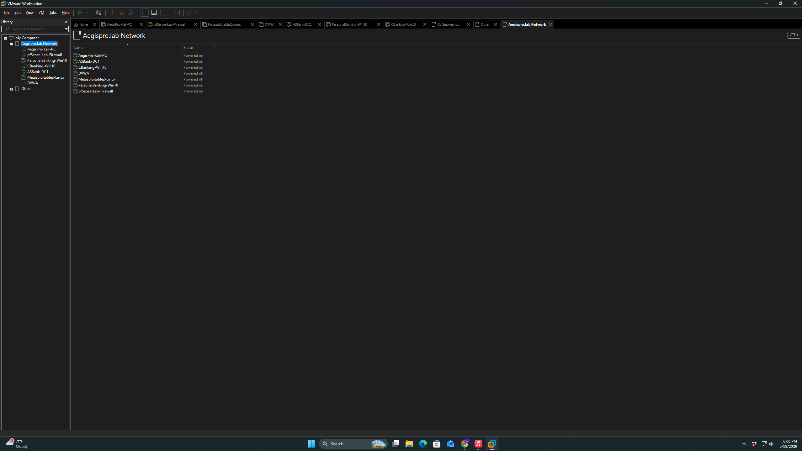

# Phase 1 — VMware Setup & Virtual Machine Installation

## Objective

Establish the foundational hypervisor environment by importing and creating all required virtual machines in VMware Workstation Pro. This phase covers the installation and initial configuration of every VM in the lab before any networking is applied.

## Environment

| Component | Details |
|-----------|---------|
| Hypervisor | VMware Workstation Pro 25H2 (25.0.0.24995812) |
| Host OS | Windows (host machine) |
| Virtualization | Intel VT-x / AMD-V enabled in BIOS |

## Virtual Machines Deployed

| VM | Role | Source | Method |
|----|------|--------|--------|
| Kali Linux 2025.2 | Attacker / assessment platform | kali.org (pre-built VMware image) | OVA import |
| pfSense | Router / Firewall / Switch | pfsense.org | ISO install |
| Windows Server 2019 | Domain Controller (DC01) | Microsoft Evaluation Center | ISO install |
| ASB-CB-WS01 | Domain workstation — Commercial Banking | Microsoft | ISO install |
| ASB-PB-WS02 | Domain workstation — Personal Banking | Microsoft | ISO install |
| Metasploitable 2 | Intentionally vulnerable Linux target | Rapid7 / SourceForge | VMX import |
| DVWA | Vulnerable web application target | VulnHub (OVA) | OVA import |

## Steps Taken

### 1.1 — Pre-installation checklist

Before importing or installing any VM, the following was confirmed on the host machine:

- VMware Workstation Pro 25H2 installed and licensed
- Virtualization (VT-x / AMD-V) enabled in BIOS
- Sufficient disk space allocated for all VMs (recommend 500GB+ free)
- All ISO and OVA files downloaded and SHA256 checksums verified

### 1.2 — Importing pre-built images (Kali, Metasploitable 2, DVWA)

For pre-built VMware images, the import process was consistent across all three:

1. **File → Open** in VMware Workstation Pro
2. Selected the `.ova` or `.vmx` file
3. When prompted "I moved it or I copied it" → selected **I copied it**
4. Accepted the default import location
5. Did **not** power on any VM at this stage — network configuration is completed in Phase 2 before any VM is started

> **Note:** Metasploitable 2 ships as a pre-built VMware ZIP. After extracting, the `.vmx` file was opened directly via File → Open. The VM presented with two network adapters by default — this is a pre-existing configuration from the original Rapid7 build and was left as-is since it does not affect lab functionality.

### 1.3 — Creating the pfSense VM

pfSense requires a manual VM creation since it installs from ISO:

1. **File → New Virtual Machine → Custom (Advanced)**
2. Selected the pfSense ISO as the installer disc image
3. OS type set to: **Other → FreeBSD 64-bit**
4. VM name: `pfSense-Lab-Firewall`
5. Disk size: 20 GB (thin provisioned)
6. RAM: 2 GB
7. Before completing: clicked **Customize Hardware** and added a **second Network Adapter** — pfSense requires two NICs (WAN and LAN)
8. Left adapter types as default — configured in Phase 2

### 1.4 — Creating the Windows Server 2019 VM (DC01)

1. **File → New Virtual Machine → Custom (Advanced)**
2. Selected the Windows Server 2019 evaluation ISO
3. OS type: **Microsoft Windows → Windows Server 2019**
4. VM name: `DC01-ASBankDC1`
5. Disk: 60 GB
6. RAM: 4 GB
7. CPU: 2 cores
8. Network adapter left as default — configured in Phase 2

### 1.5 — Creating the Windows 10 Workstation VMs

Two Windows 10 Pro VMs were created to serve as domain-joined workstations representing different bank departments:

| VM Name | Department | Role |
|---------|-----------|------|
| ASB-CB-WS01 | Commercial Banking | Lending officer / relationship manager workstation |
| ASB-PB-WS02 | Personal Banking | Teller / retail banking workstation |

Each VM was created with:
- Disk: 60 GB
- RAM: 4 GB
- CPU: 2 cores
- OS type: **Microsoft Windows → Windows 10 x64**

### 1.6 — VMware library confirmation

After all VMs were imported or created, the VMware library confirmed all seven VMs present before powering anything on.

## Observations

- Kali Linux 2025.2 (Rolling) was used as the attacker platform — the rolling release model ensures tools stay current without requiring full OS reinstalls
- Metasploitable 2 presented with two network adapters out of the box — this is a known characteristic of the original Rapid7 pre-built image and does not affect lab functionality
- All VMs were kept powered off until Phase 2 network configuration was completed — this prevents any VM from acquiring incorrect network settings before pfSense is in place

## CISSP Domain Alignment

| Domain | Relevance |
|--------|-----------|
| Domain 4 — Communication & Network Security | Hypervisor network isolation design |
| Domain 6 — Security Assessment & Testing | Lab environment construction for security testing |

---

*Next: [Phase 2 — pfSense Network Configuration](./phase-2-pfsense-network.md)*
