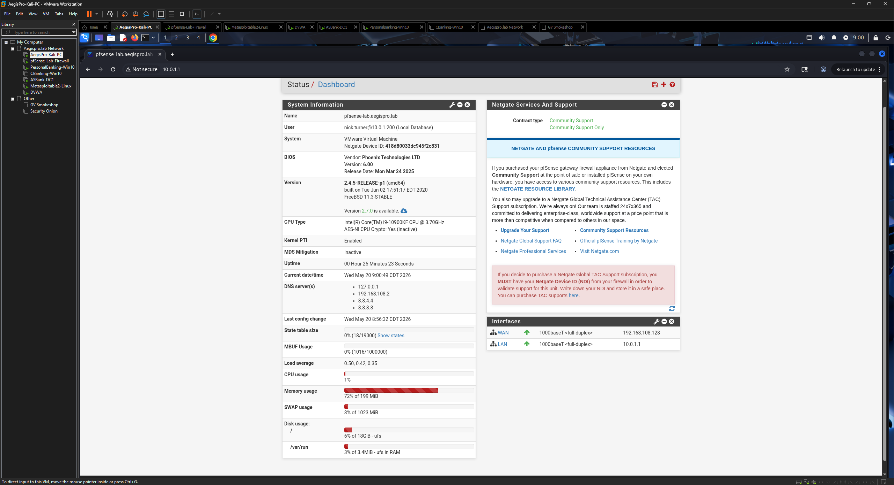
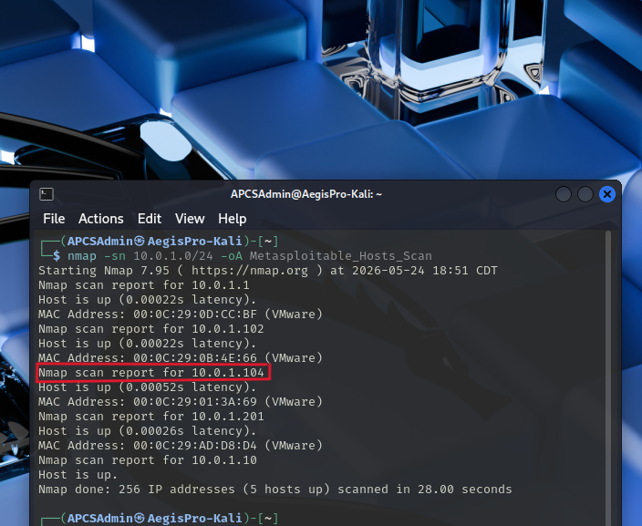

# Phase 2 — pfSense Network Configuration

## Objective

Configure pfSense as the central network choke point for the lab — providing routing, firewalling, DHCP, and DNS services across all virtual machines. This phase establishes the network architecture that all subsequent phases depend on.

## Network Architecture

```
┌────────────────────────────────────────────────────────────────────┐
│                       VMware Host Machine                          │
│                                                                    │
│   ┌─────────────┐         ┌──────────────────────────────┐        │
│   │  Kali Linux │         │         pfSense VM           │        │
│   │  (Attacker) │◄───────►│   Router / Firewall / Switch │        │
│   │  10.0.1.x   │         │   WAN: VMnet8 (NAT)          │        │
│   └─────────────┘         │   LAN: 10.0.1.1              │        │
│                           └──────────────┬───────────────┘        │
│                                          │                         │
│        ┌─────────────────────────────────┴──────────────┐         │
│        │                 Lab LAN (10.0.1.0/24)          │         │
│        │                                                 │         │
│   DC01 (10.0.1.201)   ASB-CB-WS01   ASB-PB-WS02        │         │
│   Metasploitable 2    DVWA VM       VulnHub Targets     │         │
└────────────────────────────────────────────────────────────────────┘
```

## Network Segments

| Segment | Interface | Subnet | Purpose |
|---------|-----------|--------|---------|
| WAN | pfSense WAN (VMnet8) | NAT via VMware | Simulated external / internet access |
| LAN | pfSense LAN (VMnet2) | 10.0.1.0/24 | Internal lab network — all VMs |

## IP Address Inventory

| VM | IP Address | Assignment |
|----|-----------|------------|
| pfSense LAN | 10.0.1.1 | Static |
| DC01 (ASBankDC1) | 10.0.1.201 | Static |
| Kali Linux 2025.2 | 10.0.1.x | DHCP |
| ASB-CB-WS01 | 10.0.1.x | DHCP |
| ASB-PB-WS02 | 10.0.1.x | DHCP |
| Metasploitable 2 | 10.0.1.x | DHCP |
| DVWA | 10.0.1.x | DHCP |

## Steps Taken

### 2.1 — Creating VMware network segments

In VMware Workstation Pro: **Edit → Virtual Network Editor** (run as Administrator):

| Network | Type | Subnet | Purpose |
|---------|------|--------|---------|
| VMnet8 | NAT | 192.168.x.0/24 | pfSense WAN — internet via NAT |
| VMnet2 | Host-Only | 10.0.1.0/24 | pfSense LAN — all lab VMs |

For VMnet2:
- Set type to **Host-Only**
- Subnet: `10.0.1.0` / `255.255.255.0`
- **Unchecked** "Use local DHCP service" — pfSense handles all DHCP on this segment

### 2.2 — Assigning network adapters

Before powering on any VM, each VM's network adapter(s) were configured:

| VM | Adapter Configuration |
|----|----------------------|
| pfSense | Adapter 1 (WAN): VMnet8 (NAT) — Adapter 2 (LAN): VMnet2 (Host-Only) |
| Kali Linux | VMnet2 (Host-Only) |
| DC01 | VMnet2 (Host-Only) |
| ASB-CB-WS01 | VMnet2 (Host-Only) |
| ASB-PB-WS02 | VMnet2 (Host-Only) |
| Metasploitable 2 | VMnet2 (Host-Only) |
| DVWA | VMnet2 (Host-Only) |

### 2.3 — pfSense installation and interface assignment

1. Powered on the pfSense VM and booted through the installer
2. Selected **Auto (ZFS)** partitioning
3. After reboot, the pfSense console menu was presented
4. **Console Option 1 — Assign interfaces:**
   - WAN: `em0` (VMnet8 / NAT adapter)
   - LAN: `em1` (VMnet2 / Host-Only adapter)
   - VLAN setup: No
5. **Console Option 2 — Set LAN IP:**
   - LAN IPv4 address: `10.0.1.1`
   - Subnet bit count: `24`
   - DHCP on LAN: enabled
   - DHCP range: `10.0.1.100` to `10.0.1.200`

### 2.4 — Accessing the pfSense web UI

1. Powered on Kali Linux
2. Confirmed Kali received a DHCP address on the 10.0.1.0/24 subnet: `ip a`
3. Opened Firefox and navigated to `http://10.0.1.1`
4. Logged in with default credentials and changed the admin password immediately
5. Completed the setup wizard:
   - Hostname: `pfsense-lab`
   - Domain: `aegispro.lab`
   - DNS: `8.8.8.8` / `8.8.4.4`
   - Timezone: `America/Chicago`



### 2.5 — Configuring pfSense DNS Resolver

The **DNS Resolver (unbound)** was used rather than the DNS Forwarder. Key reasons:

- DNS Resolver performs its own recursive lookups — does not depend on an upstream provider
- Supports DNSSEC validation
- More privacy-conscious — queries go directly to authoritative servers rather than a third-party resolver
- DNS Forwarder and DNS Resolver cannot run simultaneously on port 53 — Forwarder was confirmed disabled

A **domain override** was added to route internal AD domain queries to DC01:

- **Services → DNS Resolver → Domain Overrides → Add**
- Domain: `ASBank.com`
- IP: `10.0.1.201` (DC01)
- This ensures Kali and other non-domain machines can resolve `ASBank.com` internal names through pfSense, which forwards those queries to DC01's authoritative DNS

### 2.6 — Configuring DHCP to use DC01 as DNS

To ensure all domain-joined clients automatically use DC01 as their DNS server:

- **Services → DHCP Server → LAN → DNS Servers**
- DNS Server 1: `10.0.1.201` (DC01)
- DNS Server 2: `10.0.1.1` (pfSense — fallback for non-domain machines)

This mirrors real enterprise AD network design where the domain controller serves as authoritative DNS for all internal name resolution.

### 2.7 — Connectivity verification

```bash
# From Kali
ip a                          # Confirmed 10.0.1.x DHCP lease
ping -c 4 10.0.1.1            # pfSense LAN reachable
nslookup google.com           # External DNS resolving
curl -I https://google.com    # Internet access confirmed
nmap -sn 10.0.1.0/24          # All lab VMs discovered
```



## Troubleshooting Notes

### DHCP pool misconfiguration

During initial pfSense setup, the DHCP range was accidentally configured with identical start and end addresses (both set to `10.0.1.200`). This meant only one VM could receive a DHCP lease at a time — additional VMs failed to obtain addresses.

**Resolution:** Corrected via pfSense web UI:
- **Services → DHCP Server → LAN → Range**
- From: `10.0.1.100`
- To: `10.0.1.200`

After correction, all VMs received unique leases in the expected range.

### DNS resolution failure (ASBank.com)

Because the lab domain uses the `.com` TLD, public DNS resolvers returned `NXDOMAIN` when queried for `ASBankDC1.ASBank.com` — the domain exists only internally and is not registered publicly.

**Resolution:** Added a domain override in the pfSense DNS Resolver pointing `ASBank.com` queries to DC01 at `10.0.1.201`. This is the standard solution for split-horizon DNS in environments using real TLDs for internal domains.

**Lesson learned:** Lab domains should use reserved or non-routable TLDs (`.local`, `.lab`, `.internal`) to avoid this conflict. The `.com` domain was retained from a prior project and kept for continuity.

### DC01 unable to reach internet via forwarders

DC01's configured DNS forwarders (8.8.8.8 / 8.8.4.4) were timing out during validation. Root cause was DC01's default gateway was not correctly set after static IP configuration.

**Resolution:** Confirmed default gateway on DC01 was set to `10.0.1.1` (pfSense LAN). After correction, forwarder validation succeeded and external name resolution from DC01 was restored.

## CISSP Domain Alignment

| Domain | Relevance |
|--------|-----------|
| Domain 4 — Communication & Network Security | Network segmentation, routing, firewall architecture, DNS design |
| Domain 6 — Security Assessment & Testing | Isolated lab network supporting assessment activities |
| Domain 1 — Security & Risk Management | Network isolation as a risk control for lab safety |

---

*Previous: [Phase 1 — VMware Setup](./phase-1-vmware-setup.md)*
*Next: [Phase 3 — Kali Linux Tool Verification](./phase-3-kali-tools.md)*
