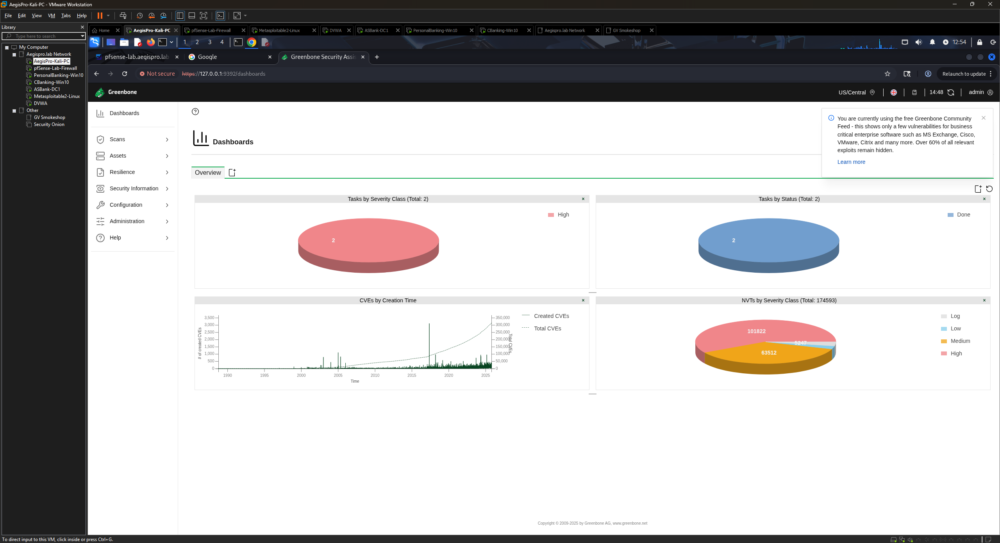

# Phase 3 — Kali Linux Tool Verification & Configuration

## Objective

Verify all required security assessment tools are installed and functional on the Kali Linux attack platform. Configure Burp Suite proxy for web application testing and bring OpenVAS / GVM online for vulnerability scanning.

## Environment

| Component | Details |
|-----------|---------|
| OS | Kali GNU/Linux 2025.2 (Rolling) |
| Kernel | Linux (kali-rolling) |
| Base | Debian-based |
| Role | Primary attack and assessment platform |
| IP | 10.0.1.x (DHCP from pfSense) |

## Tools Verified

### Vulnerability Assessment

| Tool | Purpose |
|------|---------|
| **OpenVAS / GVM** | Network vulnerability scanner — authenticated and unauthenticated scans, CVSS scoring, report generation |
| **Nmap** | Network discovery, port scanning, service enumeration, OS fingerprinting |
| **Nikto** | Web server scanner — misconfigurations, outdated software, known CVEs |

### Exploitation & Testing

| Tool | Purpose |
|------|---------|
| **Metasploit Framework** | Exploitation framework — validating vulnerabilities, post-exploitation practice |
| **Burp Suite Community** | Web application proxy — HTTP/S interception, injection testing, web vulnerability analysis |

### Active Directory Attack Tooling

| Tool | Purpose |
|------|---------|
| **Impacket suite** | Kerberoasting, AS-REP Roasting, Pass-the-Hash, DCSync |
| **CrackMapExec** | AD enumeration, credential validation, lateral movement |
| **Responder** | LLMNR/NBT-NS poisoning, NTLM hash capture |
| **BloodHound / Neo4j** | AD attack path visualization |
| **Hashcat** | Offline password and hash cracking |
| **enum4linux-ng** | SMB / AD anonymous enumeration |

### Analysis & Monitoring

| Tool | Purpose |
|------|---------|
| **Wireshark** | Packet capture, protocol analysis, traffic inspection |

## Steps Taken

### 3.1 — System update

Before verifying tools, the system was fully updated to ensure all packages were at current versions:

```bash
sudo apt update && sudo apt full-upgrade -y
```

### 3.2 — Tool verification

Each tool was verified with a version check:

```bash
nmap --version
msfconsole --version
gvm-check-setup
nikto -Version
wireshark --version
burpsuite          # Opens GUI — version confirmed via Help → About
```

### 3.3 — AD attack tool installation

The following tools were confirmed installed or installed fresh for Active Directory assessment practice:

```bash
# Impacket suite
sudo apt install -y impacket-scripts python3-impacket

# CrackMapExec
sudo apt install -y crackmapexec

# Responder
sudo apt install -y responder

# enum4linux-ng
sudo apt install -y enum4linux-ng

# Hashcat
sudo apt install -y hashcat

# BloodHound and Neo4j
sudo apt install -y bloodhound neo4j
```

Most tools were pre-installed on Kali 2025.2 — the commands above confirmed or updated them to current versions.

### 3.4 — OpenVAS / GVM setup

OpenVAS (Greenbone Vulnerability Manager) was initialized for the first time:

```bash
# Initial setup — approximately 15–20 minutes
sudo gvm-setup

# Start GVM services
sudo gvm-start

# Verify setup completed successfully
sudo gvm-check-setup
```

The auto-generated admin password displayed during `gvm-setup` was saved to the lab password manager immediately.

**Accessing the web interface:**
1. Opened Firefox in Kali
2. Navigated to `https://127.0.0.1:9392`
3. Accepted the self-signed certificate
4. Logged in with admin credentials



### 3.5 — Burp Suite proxy configuration

Burp Suite Community Edition was configured to intercept HTTP/S traffic from Firefox:

1. Opened Burp Suite
2. Confirmed proxy listener on `127.0.0.1:8080` under **Proxy → Options**
3. In Firefox: **Preferences → Network Settings → Manual proxy**
   - HTTP Proxy: `127.0.0.1`
   - Port: `8080`
4. Browsed to an HTTP test site and confirmed Burp intercepted the request
5. Forwarded the request and confirmed the page loaded
6. Set **Intercept: Off** for general browsing — turned on only when actively testing

## Observations

- Kali 2025.2 ships with the majority of required tools pre-installed — the update step is more important than fresh installs for most tools
- OpenVAS / GVM setup takes 15–20 minutes on first run due to NVT feed synchronization — this is expected behavior and not an error
- The BloodHound and Neo4j installation requires Neo4j to be started before BloodHound can connect — `sudo neo4j console` must be run first when using BloodHound

## CISSP Domain Alignment

| Domain | Relevance |
|--------|-----------|
| Domain 6 — Security Assessment & Testing | Tool proficiency across scanning, exploitation, and AD assessment |
| Domain 4 — Communication & Network Security | Network traffic analysis via Wireshark, proxy-based web testing |

---

*Previous: [Phase 2 — pfSense Network Configuration](./phase-2-pfsense-network.md)*
*Next: [Phase 4 — Target Machine Setup](./phase-4-target-machines.md)*
