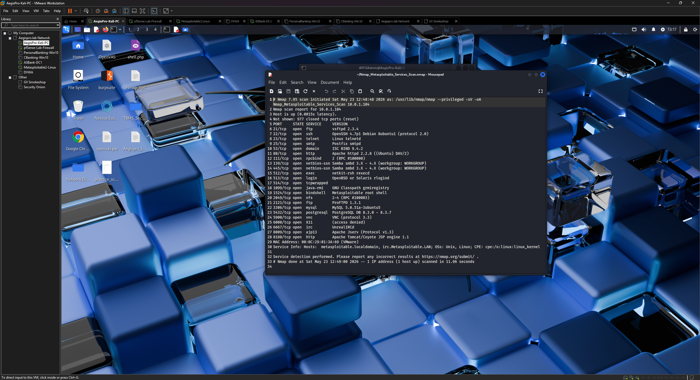

# Phase 4 — Linux & Web Application Target Setup

## Objective

Bring the Linux and web application target VMs online, confirm network connectivity from Kali, and document the services and vulnerability profile of each target. These machines form the non-Windows assessment targets for vulnerability scanning, web application testing, and exploitation practice.

## Targets Configured

| VM | Type | IP | Primary Use |
|----|------|----|------------|
| Metasploitable 2 | Intentionally vulnerable Linux | 10.0.1.x | Vulnerability assessment, Metasploit exploitation practice |
| DVWA | Vulnerable web application | 10.0.1.x | Web app testing, Burp Suite practice, OWASP Top 10 |
| VulnHub machines | CTF-style rotating targets | 10.0.1.x | Varied — documented per machine |

## Steps Taken

### 4.1 — Metasploitable 2

#### Startup and initial access

1. Powered on the Metasploitable 2 VM
2. Logged in at the console with default credentials: `msfadmin / msfadmin`
3. Confirmed the VM received a DHCP address from pfSense

#### Connectivity verification from Kali

```bash
ping -c 4 <metasploitable-IP>
nmap -sV <metasploitable-IP>
```

#### Service profile

The Nmap service scan returned a large number of open ports — all intentional. Key services identified:

| Port | Service | Version / Notes |
|------|---------|----------------|
| 21 | FTP | vsftpd 2.3.4 (contains backdoor — CVE-2011-2523) |
| 22 | SSH | OpenSSH 4.7p1 |
| 23 | Telnet | Linux telnetd |
| 25 | SMTP | Postfix |
| 80 | HTTP | Apache 2.2.8 |
| 139/445 | SMB | Samba 3.x |
| 3306 | MySQL | 5.0.51a |
| 5432 | PostgreSQL | 8.3.0 |
| 8180 | HTTP | Apache Tomcat |

This service profile forms the basis of the Phase 6 vulnerability assessment.



### 4.2 — DVWA (Damn Vulnerable Web Application)

DVWA was deployed as a separate VM on the lab LAN rather than installed locally on Kali. This decision was intentional — running DVWA as a separate host means all web traffic traverses the pfSense firewall, allowing firewall rule testing and Wireshark capture from a realistic network perspective.

#### Setup

1. Powered on the DVWA VM
2. Confirmed DHCP lease from pfSense
3. From Kali Firefox, navigated to `http://<DVWA-IP>/dvwa/login.php`
4. Default credentials: `admin / password`
5. Navigated to **Setup / Reset DB → Create / Reset Database**
6. Confirmed main DVWA menu loaded with all vulnerability categories
7. Set initial security level to **Low** for baseline testing

#### Vulnerability categories available

| Category | Description |
|----------|-------------|
| SQL Injection | Classic and blind injection |
| XSS (Reflected) | Reflected cross-site scripting |
| XSS (Stored) | Persistent cross-site scripting |
| Command Injection | OS command injection via web form |
| File Upload | Unrestricted file upload |
| File Inclusion | Local and remote file inclusion |
| CSRF | Cross-site request forgery |
| Insecure CAPTCHA | Broken CAPTCHA implementation |
| Brute Force | Login brute force practice |

These categories map directly to the OWASP Top 10 and are covered in the Phase 7 web application testing write-up.

### 4.3 — VulnHub machine (first target — Kioptrix Level 1)

The first VulnHub machine added to the lab was **Kioptrix Level 1** — a well-known beginner-friendly Linux target.

1. Downloaded from vulnhub.com
2. Imported to VMware, set network adapter to VMnet2 (Host-Only)
3. Powered on — pfSense assigned a DHCP address
4. Discovered IP via: `nmap -sn 10.0.1.0/24`

> Individual VulnHub machine write-ups are documented separately under `/vulnhub-writeups/`

## Observations

- DVWA was deliberately deployed as a separate network VM rather than installed on Kali — this creates a realistic client-server web testing scenario where traffic traverses the firewall
- Metasploitable 2 intentionally runs dozens of vulnerable services — the extensive open port list seen in Nmap output is expected and by design
- Metasploitable 2 presented with two network adapters in VMware (a pre-existing configuration from the Rapid7 build) — the second adapter was left in place as it does not affect functionality

## CISSP Domain Alignment

| Domain | Relevance |
|--------|-----------|
| Domain 6 — Security Assessment & Testing | Target enumeration, service identification, vulnerability profiling |
| Domain 4 — Communication & Network Security | Network service analysis, protocol identification |

---

*Previous: [Phase 3 — Kali Linux Tool Verification](./phase-3-kali-tools.md)*
*Next: [Phase 5 — Active Directory Environment](./phase-5-active-directory.md)*
