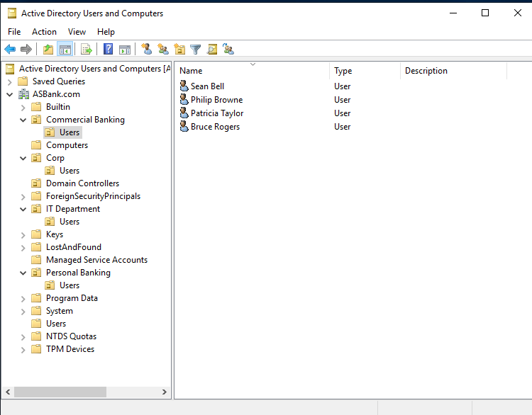
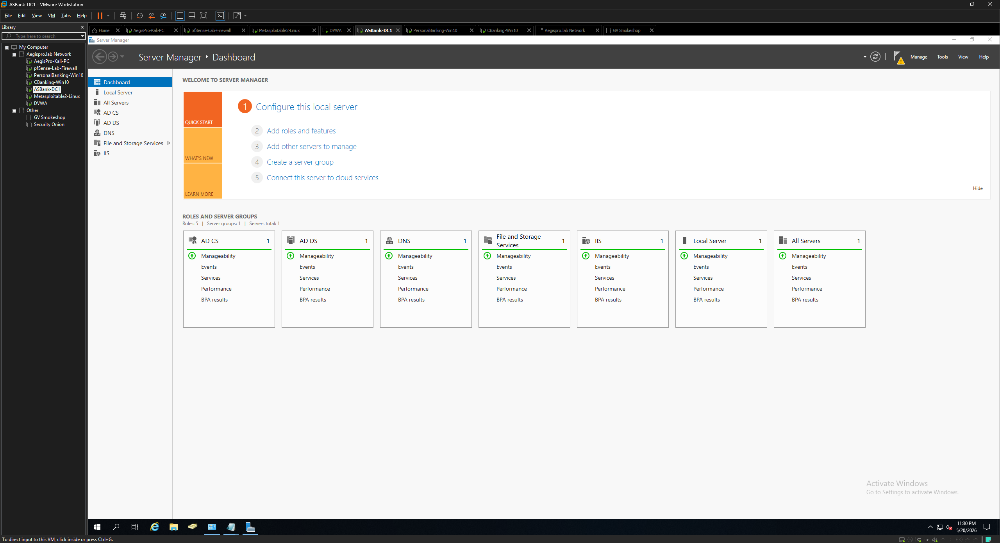
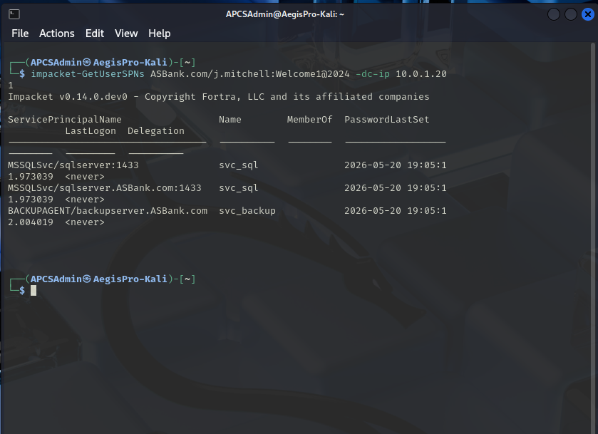

# Phase 5 — Active Directory Environment Build

## Objective

Build and document a working Windows Active Directory domain to support enterprise-realistic security assessment and attack simulation practice. The environment represents a fictional community bank (AcrossStatesBank) and mirrors the kind of AD infrastructure commonly found in small-to-mid-sized financial institutions across the DFW area.

> **Disclaimer:** AcrossStatesBank is a fictional organization created for security practice purposes. All activity is performed against owned lab infrastructure. No real organization is depicted or targeted.

## Environment

| Component | Details |
|-----------|---------|
| Domain Name | `ASBank.com` |
| Domain FQDN | `ASBankDC1.ASBank.com` |
| Domain Controller | ASBankDC1 — Windows Server 2019 |
| DC IP | 10.0.1.201 (static) |
| Forest Functional Level | Windows Server 2016 |
| DNS | Active Directory-integrated DNS on DC01 |
| Workstation 1 | ASB-CB-WS01 — Windows 10 Pro (Commercial Banking) |
| Workstation 2 | ASB-PB-WS02 — Windows 10 Pro (Personal Banking) |

## Why an Active Directory Lab Environment

Active Directory is the identity and access management backbone of the vast majority of small and mid-sized business networks — including regional banks, healthcare practices, legal firms, and professional services organizations. Understanding how AD works, how it can be misconfigured, and how attackers abuse it is a core competency for both offensive security practitioners and defensive engineers.

The AcrossStatesBank environment provides:

- A realistic domain structure mirroring a community bank's IT footprint
- Intentionally misconfigured service accounts for Kerberoasting and AS-REP Roasting practice
- A simulated user population across multiple business departments
- GPO configuration for workstation lockdown and audit logging
- A target environment for BloodHound enumeration, lateral movement, and privilege escalation practice

## OU Structure

```
ASBank.com
├── Commercial Banking
│   ├── Users
│   └── Computers
├── Personal Banking
│   ├── Users
│   └── Computers
├── Corp
│   ├── Users
│   └── Computers
├── IT Department
│   ├── Users
│   └── Computers
├── Domain Controllers
├── Servers
├── Service Accounts
├── Groups
│   ├── GRP_CommercialBanking_Users
│   ├── GRP_PersonalBanking_Users
│   ├── GRP_ITDept_Admins
│   └── GRP_AllStaff
└── Managed Service Accounts
```



## User Population (15 users total)

### Commercial Banking (4 users)

| Name | Username | Role |
|------|---------|------|
| Sean Bell | s.bell | Commercial lending |
| Philip Browne | p.browne | Relationship manager |
| Patricia Taylor | p.taylor | Commercial banking officer |
| Bruce Rogers | b.rogers | Commercial analyst |

### Personal Banking (3 users)

| Name | Username | Role |
|------|---------|------|
| James Mitchell | j.mitchell | Retail banker |
| Angela Torres | a.torres | Customer service |
| David Nguyen | d.nguyen | Teller |

### Corp (3 users)

| Name | Username | Role |
|------|---------|------|
| Robert Henderson | r.henderson | Finance / back-office |
| Karen Whitfield | k.whitfield | HR / compliance |
| Sandra Pierce | s.pierce | Operations |

### IT Department (3 users)

| Name | Username | Role |
|------|---------|------|
| Marcus Webb | m.webb | IT Administrator (Domain Admin) |
| Darnell Brooks | d.brooks | Systems administrator |
| Lisa Garrett | l.garrett | Helpdesk |

### Service Accounts (2 accounts)

| Account | SPN | Attack relevance |
|---------|-----|-----------------|
| svc_sql | `MSSQLSvc/sqlserver.ASBank.com:1433` | Kerberoastable |
| svc_backup | `BACKUPAGENT/backupserver.ASBank.com` | Kerberoastable + AS-REP Roastable |

## Steps Taken

### 5.1 — Domain Controller configuration

The AD domain was built on an existing Windows Server 2019 VM originally configured during a prior college project. The domain was retained as-is rather than rebuilt, with the following components already in place:

- Active Directory Domain Services role installed
- Domain promoted: `ASBank.com`
- DC FQDN: `ASBankDC1.ASBank.com`
- Active Directory-integrated DNS configured
- DNS forwarders: `8.8.8.8` / `8.8.4.4` for external resolution

DC01 was assigned a static IP of `10.0.1.201` outside the pfSense DHCP range (`10.0.1.100–10.0.1.200`) to ensure it is never reassigned dynamically.

### 5.2 — DNS configuration

DC01 was configured to use itself as its primary DNS server:

```powershell
Set-DnsClientServerAddress -InterfaceAlias "Ethernet0" -ServerAddresses "10.0.1.201"
```

pfSense was configured to hand out DC01's IP as the DNS server for all LAN clients via DHCP:

- **Services → DHCP Server → LAN → DNS Server 1:** `10.0.1.201`

A domain override was added in pfSense DNS Resolver to forward `ASBank.com` queries to DC01:

- **Services → DNS Resolver → Domain Overrides**
- Domain: `ASBank.com` → IP: `10.0.1.201`

> **Note on domain naming:** The `ASBank.com` domain uses a public TLD, which causes `NXDOMAIN` errors when non-domain machines query public DNS for internal names. The domain override on pfSense resolves this by routing internal domain queries to DC01 rather than public resolvers. For new lab builds, a non-routable TLD such as `.local` or `.lab` is recommended to avoid this issue.

### 5.3 — OU structure creation

The OU structure was built to reflect a realistic community bank organizational hierarchy. Business unit OUs (Commercial Banking, Personal Banking, Corp, IT Department) each contain sub-OUs for Users and Computers, enabling department-specific Group Policy application.

```powershell
# Verify final OU structure
Get-ADOrganizationalUnit -Filter * | 
    Select Name, DistinguishedName | 
    Sort-Object DistinguishedName | 
    Format-Table -AutoSize
```

### 5.4 — User account creation

Domain users were created using a direct PowerShell approach on DC01, targeting the correct OU distinguished names:

```powershell
# Example — Personal Banking user
New-ADUser -Name "James Mitchell" -GivenName "James" -Surname "Mitchell" `
    -SamAccountName "j.mitchell" -UserPrincipalName "j.mitchell@ASBank.com" `
    -Path "OU=Users,OU=Personal Banking,DC=ASBank,DC=com" `
    -AccountPassword (ConvertTo-SecureString "Welcome1@2024" -AsPlainText -Force) `
    -Enabled $true -PasswordNeverExpires $true
```

> **Note on CSV import:** An attempt was made to bulk-import users via a third-party PowerShell CSV import script. The script produced an `ADException 8406` error ("No superior reference configured") when run from a domain workstation rather than the DC directly. Resolution was to run the commands directly on DC01, which has full AD forest context. This is a common pitfall with AD import scripts executed remotely.

### 5.5 — Workstation domain join

Both Windows 10 workstations were joined to the `ASBank.com` domain:

1. Configured DNS on each workstation to point to DC01 (`10.0.1.201`)
2. **System Properties → Computer Name → Change → Domain:** `ASBank.com`
3. Entered Domain Admin credentials
4. Rebooted
5. Logged in with a domain user account to verify

> **Troubleshooting note:** One workstation experienced domain connectivity issues after join due to the local Administrator account being disabled by default (standard Windows 10 behavior) and the DNS server being set statically to an incorrect value. Resolution involved booting from a live Kali ISO and using `chntpw` to re-enable and blank the local Administrator password, then correcting the DNS configuration to point to DC01. This is documented as a real troubleshooting scenario encountered during the lab build.




### 5.6 — Service account SPN configuration

Service Principal Names were assigned to service accounts to enable Kerberoasting practice:

```powershell
# Assign SPNs to svc_sql
setspn -a MSSQLSvc/sqlserver.ASBank.com:1433 ASBank\svc_sql
setspn -a MSSQLSvc/sqlserver:1433 ASBank\svc_sql

# Assign SPN to svc_backup
setspn -a BACKUPAGENT/backupserver.ASBank.com ASBank\svc_backup

# Disable Kerberos pre-authentication on svc_backup (AS-REP Roastable)
Set-ADAccountControl -Identity "svc_backup" -DoesNotRequirePreAuth $true
```

**Verification from Kali using Impacket:**

```bash
impacket-GetUserSPNs ASBank.com/j.mitchell:Welcome1@2024 -dc-ip 10.0.1.201
```

Output confirmed all three SPNs were correctly registered and visible to an authenticated domain user:

```
ServicePrincipalName                    Name        MemberOf  PasswordLastSet
--------------------------------------  ----------  --------  ---------------
MSSQLSvc/sqlserver:1433                 svc_sql               2026-05-20
MSSQLSvc/sqlserver.ASBank.com:1433      svc_sql               2026-05-20
BACKUPAGENT/backupserver.ASBank.com     svc_backup            2026-05-20
```



### 5.7 — Group Policy configuration

Two baseline GPOs were created:

**ASBank-Workstation-Lockdown** (linked to each department's Computers OU):
- Screen saver timeout: 900 seconds with password protection
- Disable CMD for standard users
- Disable PowerShell via Software Restriction Policy

**ASBank-Audit-Policy** (linked at domain root):
- Account Logon: Success and Failure
- Account Management: Success and Failure
- Logon/Logoff: Success and Failure
- Privilege Use: Success and Failure

The Audit Policy GPO is the most critical for attack practice — it generates the Windows Event IDs that will be analyzed during Phase 9 AD attack scenarios (4768, 4769, 4771 for Kerberos; 4624/4625 for logon events; 4648 for explicit credential use).

## Intentional Weaknesses Documented

The following weaknesses are deliberately configured for security assessment practice. They represent common findings in real SMB and community bank AD environments:

| Weakness | Account / Setting | Attack enabled |
|----------|------------------|---------------|
| Weak service account password | svc_sql | Kerberoasting + offline crack |
| SPN registered on user account | svc_sql, svc_backup | Kerberoasting |
| Pre-authentication disabled | svc_backup | AS-REP Roasting |
| LLMNR/NBT-NS enabled | Domain-wide (default) | Responder hash capture |
| No LAPS deployed | ASB-CB-WS01, ASB-PB-WS02 | Local admin credential reuse |
| Weak domain password policy | Domain root GPO | Password spray, cracking |
| Domain Admin on workstation | m.webb logs into workstations | Credential exposure risk |

These weaknesses are intentional and documented here to make clear they represent known misconfigurations introduced for practice — not undiscovered vulnerabilities.

## Observations

- Building the AD environment with realistic department-based OUs (rather than generic IT OUs) required more planning upfront but produces substantially more realistic attack scenarios and write-ups
- The CSV bulk import script failure was a useful real-world troubleshooting experience — the error pointed to a fundamental concept (AD commands require full forest context, best executed on the DC) that is worth understanding
- Workstation naming convention (`ASB-CB-WS01`, `ASB-PB-WS02`) mirrors how a real bank IT team would name machines — department code + workstation number

## CISSP Domain Alignment

| Domain | Relevance |
|--------|-----------|
| Domain 5 — Identity & Access Management | AD user/group/role design, Kerberos architecture, GPO-based access controls, OU delegation |
| Domain 6 — Security Assessment & Testing | Intentional misconfiguration for assessment practice, SPN enumeration, attack surface analysis |
| Domain 1 — Security & Risk Management | Risk-based design — documented weaknesses with associated attack paths and business impact |
| Domain 4 — Communication & Network Security | Domain DNS architecture, Kerberos traffic, SMB/LDAP service ports |

---

*Previous: [Phase 4 — Target Machine Setup](./phase-4-target-machines.md)*
*Next: [Phase 6 — Vulnerability Assessment](./phase-6-vulnerability-assessment.md)*
