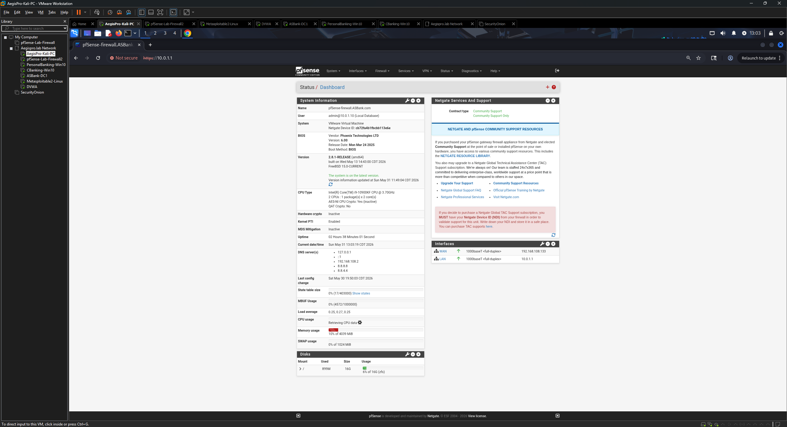
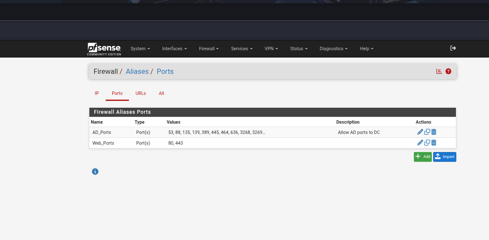
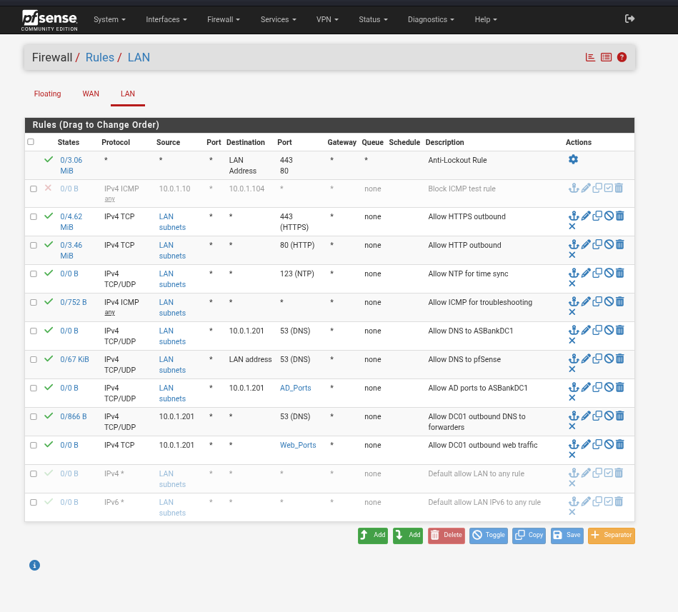
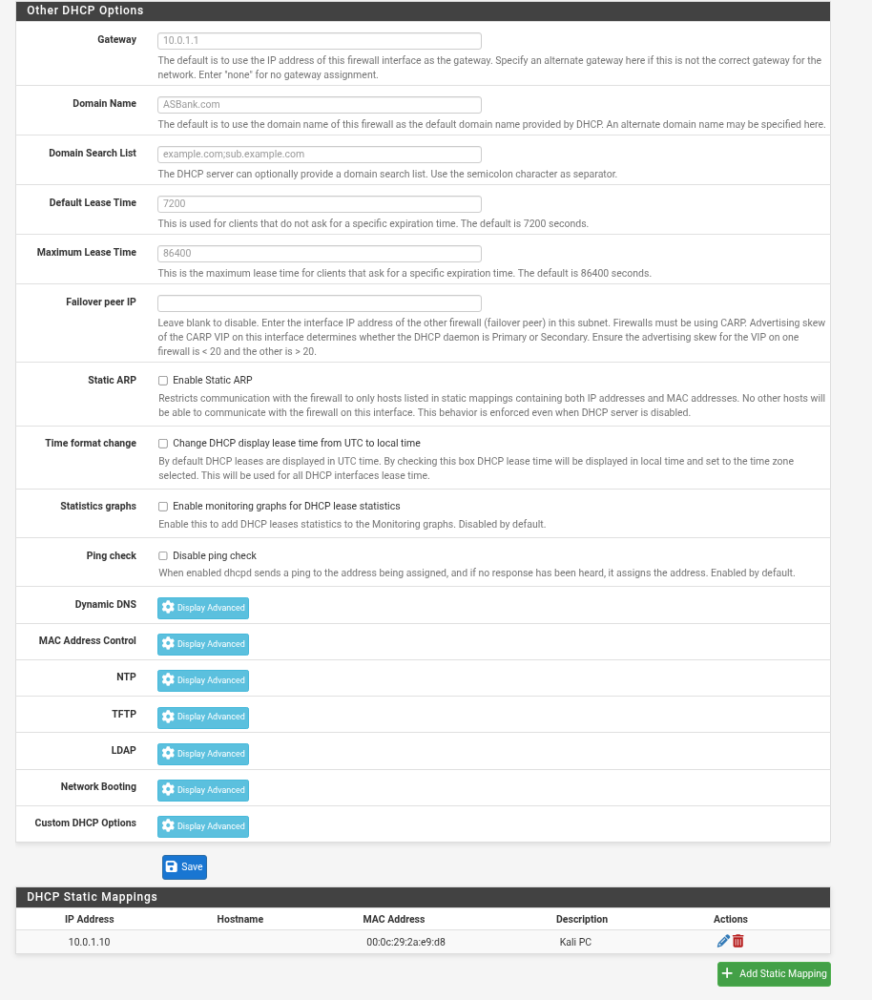
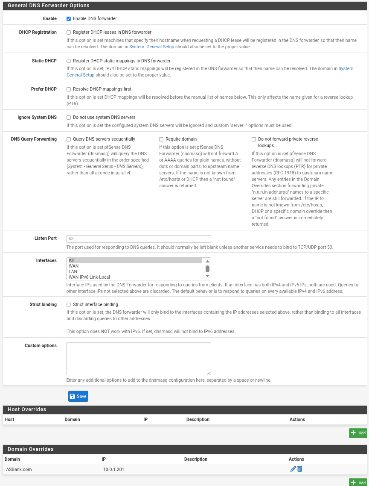
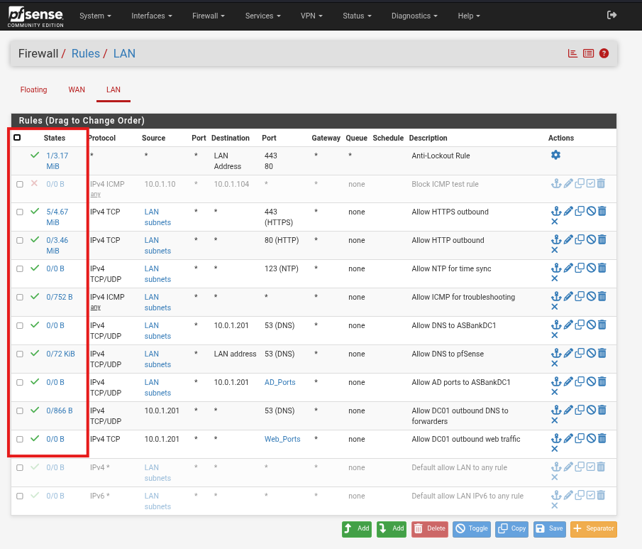
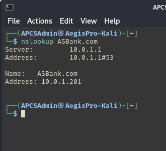
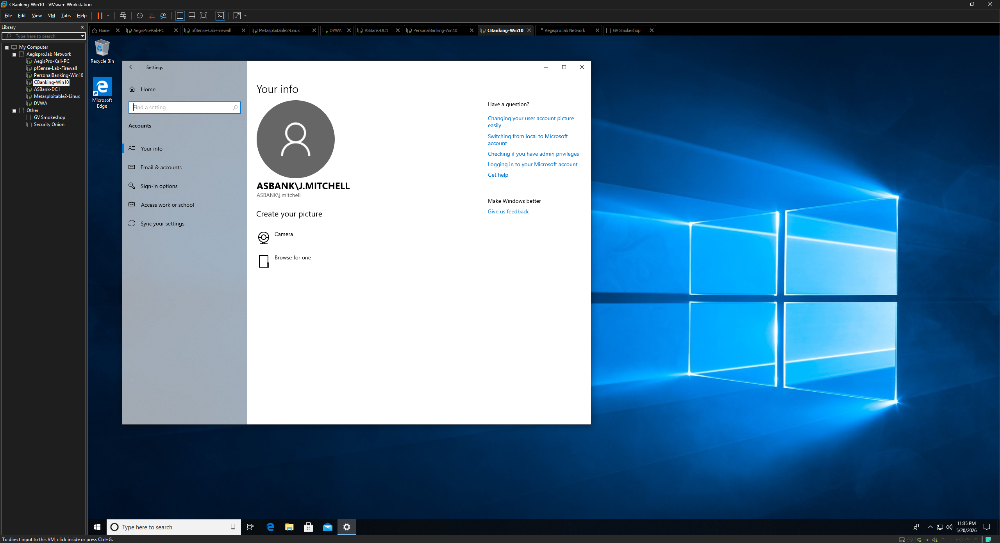

# Phase 8 — Firewall Rule Testing & pfSense Upgrade
## Target: pfSense Lab Firewall
### AegisPro CyberShield TX — Lab Build Documentation

---

## Objective

Upgrade the lab firewall from pfSense 2.4.5-RELEASE to 2.8.1, rebuild the complete default-deny ruleset from scratch, and validate each rule through systematic testing. This phase also documents a key architectural finding discovered during testing — the limitation of perimeter firewall rules in a flat network — and establishes the requirement for VLAN segmentation in Phase 14.

> **Disclaimer:** All testing performed within the AegisPro CyberShield TX isolated lab network (10.0.1.0/24). No production systems or external networks were targeted.

---

## Environment

| Component | Details |
|-----------|---------|
| Firewall | pfSense 2.8.1 (upgraded from 2.4.5-RELEASE Patch 1) |
| Firewall IP | 10.0.1.1 (LAN) |
| LAN Network | 10.0.1.0/24 — VMnet2 (host-only) |
| WAN | VMnet8 (NAT) |
| Attacker / test host | AegisPro-Kali — 10.0.1.10 |
| Domain Controller | ASBankDC1 — 10.0.1.201 |
| Vulnerable target | Metasploitable2 — 10.0.1.104 |
| Hypervisor | VMware Workstation Pro 25H2 |
| Assessment date | May 2026 |

---

## Background — Why a Fresh Install

The lab was previously running pfSense 2.4.5-RELEASE (Patch 1). This version contains a known PHP OPcache memory bug that causes the web configurator to crash when the VM is allocated more than 2GB of RAM. Following a host machine upgrade to 64GB DDR4, the pfSense VM RAM allocation needed to increase to 4GB — which first required upgrading pfSense.

Per Netgate documentation, the version gap between 2.4.5 and 2.8.1 is too large for an in-place upgrade. A fresh VM installation was performed rather than attempting an upgrade path.

The pfSense upgrade was the trigger for a complete rebuild and documentation of the firewall configuration — treating it as a clean implementation exercise rather than a migration.

---

## Step 1 — Pre-Upgrade Documentation

Before decommissioning the 2.4.5 instance, all configuration was documented via screenshots and the lab configuration record. A VMware snapshot of the 2.4.5 VM was taken as a rollback point before the upgrade began.

| Item | Location in pfSense | Details Captured |
|------|---------------------|-----------------|
| Firewall rules | Firewall → Rules → LAN | All 10 active rules in order |
| Aliases | Firewall → Aliases | AD_Ports, Web_Ports — all port values |
| DHCP static mappings | Services → DHCP Server → LAN | Kali static MAC-to-IP binding |
| DNS domain override | Services → DNS Forwarder | ASBank.com → 10.0.1.201 |
| Interface assignments | Interfaces → Assignments | WAN/LAN adapter mapping |
| General settings | System → General Setup | Hostname, timezone |

This documentation served as the rebuild reference once the fresh 2.8.1 VM was stood up.

---

## Step 2 — pfSense 2.8.1 Installation

**ISO:** pfSense-CE-2.8.1-RELEASE-amd64.iso
**Installation type:** Fresh VM — no migration from existing 2.4.5 instance

### VM Configuration

| Setting | Value |
|---------|-------|
| Guest OS | FreeBSD 64-bit |
| RAM | 4GB (previously capped at 2GB due to OPcache bug — now resolved in 2.8.1) |
| vCPUs | 1 processor / 2 cores |
| NIC 1 | VMnet8 (NAT) — WAN interface |
| NIC 2 | VMnet2 (host-only) — LAN interface |
| Disk | 20GB |
| Partition type | ZFS Auto (Stripe) — default for 2.8.x |

### Interface Assignment

Interfaces were assigned at the console before accessing the web GUI:

```
WAN → em0  (VMnet8 / NAT)
LAN → em1  (VMnet2 / host-only)
LAN IP: 10.0.1.1/24
```

### Notable 2.8.x Change — LAN Macro Rename

In pfSense 2.8.x, the rule macro previously labeled **"LAN net"** (representing the full LAN subnet) has been renamed to **"LAN Subnets"**. Rules referencing the full lab network (10.0.1.0/24) were updated to use **LAN Subnets** accordingly. The **LAN Address** macro retains its original meaning — pfSense's own LAN IP (10.0.1.1) — and was used where rules target pfSense itself.



---

## Step 3 — Alias Configuration

Aliases were created before firewall rules to ensure all rule dependencies were in place. Aliases allow a single named object to represent multiple ports or addresses, keeping individual rules readable and making updates easier.

### AD_Ports

| Field | Value |
|-------|-------|
| Name | `AD_Ports` |
| Type | Ports |
| Description | Active Directory required ports — ASBankDC1 |

**Ports included:** 53, 88, 135, 139, 389, 445, 464, 636, 3268, 3269, 49152:65535

These ports cover the full range of services required for Active Directory operations — DNS, Kerberos, RPC endpoint mapper, NetBIOS, LDAP, SMB, Kerberos password change, LDAP SSL, Global Catalog, and the dynamic RPC high port range.

### Web_Ports

| Field | Value |
|-------|-------|
| Name | `Web_Ports` |
| Type | Ports |
| Description | HTTP and HTTPS outbound |

**Ports included:** 80, 443



---

## Step 4 — Firewall Rule Rebuild

All rules were recreated under Firewall → Rules → LAN. pfSense evaluates LAN rules top-to-bottom — the first matching rule wins. The default-deny policy is enforced by leaving the default "allow LAN to any" rules disabled, meaning any traffic not explicitly permitted by rules 1–10 is dropped.

| # | State | Protocol | Source | Destination | Port | Description |
|---|-------|----------|--------|-------------|------|-------------|
| 1 | ✅ | * | LAN Address | * | 443, 80 | Anti-Lockout Rule |
| 2 | ✅ | IPv4 TCP | LAN Subnets | * | 443 (HTTPS) | Allow HTTPS outbound |
| 3 | ✅ | IPv4 TCP | LAN Subnets | * | 80 (HTTP) | Allow HTTP outbound |
| 4 | ✅ | IPv4 TCP/UDP | LAN Subnets | * | 123 (NTP) | Allow NTP for time sync |
| 5 | ✅ | IPv4 ICMP | LAN Subnets | * | * | Allow ICMP for troubleshooting |
| 6 | ✅ | IPv4 TCP/UDP | LAN Subnets | 10.0.1.201 | 53 (DNS) | Allow DNS to ASBankDC1 |
| 7 | ✅ | IPv4 TCP/UDP | LAN Subnets | LAN Address | 53 (DNS) | Allow DNS to pfSense |
| 8 | ✅ | IPv4 TCP/UDP | LAN Subnets | 10.0.1.201 | AD_Ports | Allow AD ports to ASBankDC1 |
| 9 | ✅ | IPv4 TCP/UDP | 10.0.1.201 | * | 53 (DNS) | Allow DC01 outbound DNS to forwarders |
| 10 | ✅ | IPv4 TCP | 10.0.1.201 | * | Web_Ports | Allow DC01 outbound web traffic |
| 11 | ❌ | IPv4 | LAN Subnets | * | * | Default allow LAN to any — **DISABLED** |
| 12 | ❌ | IPv6 | LAN Subnets | * | * | Default allow LAN IPv6 to any — **DISABLED** |



---

## Step 5 — Services Configuration

### DHCP Server

| Field | Value |
|-------|-------|
| Interface | LAN |
| DHCP Range | 10.0.1.100 – 10.0.1.200 |

**Static MAC-to-IP mappings:**

| Hostname | MAC Address | Assigned IP |
|----------|-------------|-------------|
| AegisPro-Kali | 00:0c:29:2a:e9:d8 | 10.0.1.10 |

Kali receives a static DHCP mapping to ensure it always gets 10.0.1.10 — its IP is referenced directly in firewall rules and assessment tooling. Metasploitable2 and DVWA receive addresses from the DHCP pool (10.0.1.100–200) and have their IPs confirmed after each boot rather than reserved.

### DNS Forwarder — Domain Override

| Field | Value |
|-------|-------|
| Domain | `ASBank.com` |
| IP Address | `10.0.1.201` |
| Description | Route internal domain queries to DC01 |

This override is critical for AD functionality. Without it, non-domain machines querying pfSense for `ASBank.com` names would receive NXDOMAIN responses from public DNS resolvers (since `ASBank.com` uses a public TLD). The domain override intercepts all queries for `ASBank.com` and routes them directly to DC01, enabling domain join, Group Policy processing, and workstation authentication to function correctly.





---

## Step 6 — Rule Validation Testing

Each rule was validated by generating the corresponding traffic type and confirming expected behavior. Pass/fail was determined by both the observable result and the state/byte counters incrementing on the correct rule in Firewall → Rules → LAN.

| Rule | Test Method | Expected Result | Actual Result |
|------|------------|-----------------|---------------|
| Allow HTTPS outbound | `curl https://example.com` from Kali | 200 response | ✅ Pass |
| Allow HTTP outbound | `curl http://example.com` from Kali | 200 response | ✅ Pass |
| Allow DNS to pfSense | `nslookup google.com 10.0.1.1` from Kali | Resolved | ✅ Pass |
| Allow DNS to DC01 | `nslookup ASBank.com 10.0.1.201` from Kali | 10.0.1.201 returned | ✅ Pass |
| DNS domain override | `nslookup ASBank.com` from Kali | 10.0.1.201 returned | ✅ Pass |
| Allow AD ports to DC01 | Domain user logon from WS01 | Successful logon | ✅ Pass |
| Allow DC01 outbound DNS | Windows Update check on DC01 | Update servers resolved | ✅ Pass |
| Allow DC01 outbound web | Windows Update download on DC01 | Download initiated | ✅ Pass |
| Allow ICMP | `ping 10.0.1.1` from Kali | Ping replies | ✅ Pass |
| Allow NTP | `ntpq -p` on DC01 | NTP peer listed | ✅ Pass |
| Default-deny | Attempted traffic on unlisted port | Dropped | ✅ Pass |







---

## Step 7 — Architectural Finding: Flat Network Firewall Limitation

### The Test

During validation an additional test was performed — attempting to block ICMP traffic from Kali (10.0.1.10) to Metasploitable2 (10.0.1.104) using a pfSense LAN rule. A block rule was created with the following parameters and positioned above all allow rules:

| Field | Value |
|-------|-------|
| Action | Block |
| Protocol | IPv4 ICMP — all |
| Source | 10.0.1.10 |
| Destination | 10.0.1.104 |
| Position | Rule 1 — above all other rules |

**Result:** ICMP was not blocked. `ping 10.0.1.104` from Kali continued to succeed regardless of rule position or configuration.

### Root Cause

Both hosts reside on the same subnet — 10.0.1.0/24 — connected via VMnet2. Traffic between hosts on the same Layer 2 segment is switched directly at the virtual network layer. It never traverses pfSense's LAN interface, so pfSense never sees it.

pfSense firewall rules only apply to traffic that enters one of its interfaces. This occurs when:

- Traffic moves between different network segments (inter-VLAN routing)
- Traffic is destined for pfSense itself (DNS, DHCP, web GUI)
- Traffic leaves the LAN toward the WAN (internet-bound)

Traffic between two hosts on the same subnet — east-west traffic — stays entirely within that segment and bypasses the firewall entirely.

```
Same-subnet traffic — NOT subject to pfSense firewall rules:

  Kali (10.0.1.10) ────────────────────── Metasploitable2 (10.0.1.104)
                          VMnet2
                       (Layer 2 switch)
                             │
                       pfSense LAN
                    (never sees this traffic)


Inter-network traffic — subject to pfSense firewall rules:

  Kali (10.0.1.10) ──── VMnet2 ──── pfSense ──── VMnet8 ──── Internet
                                         ↑
                                   Rules enforced here
```

### Why This Matters

In a flat /24 network, any host can communicate directly with any other host on the same segment regardless of perimeter firewall policy. This is not a pfSense misconfiguration — it is a fundamental constraint of flat network architecture. The firewall has no mechanism to inspect or block lateral (east-west) traffic without network segmentation forcing that traffic through a routed path.

This is the same reason enterprise networks use VLANs and microsegmentation: to ensure that inter-zone traffic must traverse a firewall or access control point, enabling east-west policy enforcement.

### Security Implication for the Lab

In the current flat topology, Kali can reach Metasploitable2, DVWA, DC01, and the workstations directly — with no firewall enforcement between them. For attack simulation purposes this is useful. For the longer-term goal of demonstrating realistic defensive controls, it is a gap that must be addressed.

### Resolution — Phase 14

This finding directly drives the Phase 14 VLAN segmentation implementation. Once VLANs are in place:

| VLAN | Subnet | Hosts |
|------|--------|-------|
| Management | 10.0.2.0/24 | Kali, Security Onion |
| Server | 10.0.3.0/24 | DC01 |
| Workstation | 10.0.4.0/24 | WS01, WS02 |
| DMZ | 10.0.5.0/24 | Metasploitable2, DVWA, MailSrv |

All inter-VLAN traffic will be routed through pfSense. A block rule for Kali → Metasploitable2 ICMP will function correctly because the traffic will enter pfSense's Management VLAN interface and be evaluated against rules before being routed toward the DMZ VLAN.

**The flat network finding is documented here as an intentional architectural observation — not a configuration failure — and the resolution path is fully planned.**

---

## Lessons Learned

> *Internal observations for professional development — not for client delivery.*

- The LAN net → LAN Subnets macro rename in pfSense 2.8.x is a minor but disorienting change when rebuilding from documentation written against 2.4.5. Always verify macro names match the running version before assuming they're equivalent.
- Rebuilding the firewall from scratch rather than migrating config produced a cleaner, better-understood ruleset. Every rule was consciously re-evaluated rather than carried over uncritically.
- The flat network ICMP finding was initially interpreted as a pfSense misconfiguration. Working through the root cause — Layer 2 switching bypassing Layer 3 firewall inspection — reinforced a fundamental networking concept that comes up directly in CISSP Domain 4 (Communication & Network Security) and in real SMB assessments where clients assume their perimeter firewall provides internal host isolation.
- pfSense 2.8.1 is noticeably more stable than 2.4.5 in the VM environment. The OPcache issue that required keeping RAM at 2GB is fully resolved — 4GB is stable with no web configurator crashes observed.
- The ZFS default partitioning in 2.8.x is a meaningful improvement for VM stability. The 2.8.0 release notes include specific ZFS write reduction improvements that make it better suited for virtualized deployments.

---

## CISSP Domain Alignment

| Domain | Relevance |
|--------|-----------|
| Domain 4 — Communication & Network Security | Firewall rule architecture, default-deny policy, Layer 2 vs Layer 3 traffic behavior, VLAN segmentation rationale |
| Domain 1 — Security & Risk Management | Documenting architectural limitations as risk findings, planned remediation path |
| Domain 6 — Security Assessment & Testing | Systematic rule validation methodology, finding root cause analysis |
| Domain 7 — Security Operations | Firewall administration, rule management, traffic monitoring via state counters |

---

## Screenshots Index

| Filename | Content |
|----------|---------|
| `pfsense-281-dashboard.png` | pfSense 2.8.1 dashboard — version confirmed |
| `pfsense-aliases.png` | Aliases page showing AD_Ports and Web_Ports |
| `pfsense-lan-rules.png` | LAN rules — all 10 active, defaults disabled |
| `pfsense-dhcp-static.png` | DHCP static mapping — Kali at 10.0.1.10 |
| `pfsense-dns-override.png` | DNS Forwarder domain override for ASBank.com |
| `pfsense-rule-counters.png` | Rule byte counters confirming traffic hits |
| `kali-nslookup-asbank.png` | nslookup ASBank.com returning 10.0.1.201 |
| `ws01-domain-logon.png` | WS01 domain logon confirming AD auth |

---

*Previous: [Phase 7 — Web Application Testing](./phase-7-web-application-testing.md)*
*Next: Phase 9 — Active Directory Attack Workflow (coming soon)*

---

*AegisPro CyberShield TX — Phase 8 Lab Documentation — May 2026*
*Lead Assessor: Nicholas Turner, CISSP*
